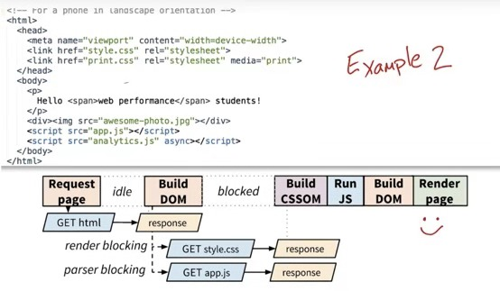

# http

## http无状态含义

HTTP是无状态的：在同一个连接中，两个成功执行的请求之间是没有关系的。这就带来了一个问题，用户没办法在一个网站进行连续的交互，比如在一个电商网站里，用户把某个商品加入了购物车中，换了一个页面后再次添加商品，两次添加商品的请求没有联系，浏览器无法知道最终用户都选择了哪些商品。而用HTTP的头部扩展，HTTP Cookies就可以解决这个问题。把Cookies添加到头部中，创建一个会话来让每次请求都能共享相同的上下文信息，相同的状态。

而HTTP的核心是无状态的，cookies的使用可以创建有状态的会话。

## 从浏览器地址栏输入url到显示页面的步骤(以HTTP为例)

1. 在浏览器地址栏输入URL

2. 浏览器查看缓存，如果请求资源在缓存中并且新鲜，跳转到转码步骤

   如果资源未缓存，发起新请求

   如果已缓存，检验是否足够新鲜，足够新鲜直接提供给客户端，否则与服务器进行验证。

   检验新鲜通常有两个HTTP头进行控制Expires和Cache-Control：

   HTTP1.0提供Expires，值为一个绝对时间表示缓存新鲜日期

   HTTP1.1增加了Cache-Control: max-age=,值为以秒为单位的最大新鲜时间

3. 浏览器解析URL获取协议，主机，端口，path

4. 浏览器组装一个HTTP（GET）请求报文

5. 浏览器获取主机ip地址，过程如下：

    i.浏览器缓存

    ii.本机缓存

    iii.hosts文件

    iv.路由器缓存

    v.ISP DNS缓存

    vi.DNS递归查询（可能存在负载均衡导致每次IP不一样）

6. 打开一个socket与目标IP地址，端口建立TCP链接，三次握手如下：

    i.客户端发送一个TCP的SYN=1，Seq=X的包到服务器端口

    ii.服务器发回SYN=1， ACK=X+1， Seq=Y的响应包
    
    iii.客户端发送ACK=Y+1， Seq=Z

7. TCP链接建立后发送HTTP请求

8. 服务器接受请求并解析，将请求转发到服务程序，如虚拟主机使用HTTP Host头部判断请求的服务程序

9. 服务器检查HTTP请求头是否包含缓存验证信息如果验证缓存新鲜，返回304等对应状态码

10. 处理程序读取完整请求并准备HTTP响应，可能需要查询数据库等操作

11. 服务器将响应报文通过TCP连接发送回浏览器

12. 浏览器接收HTTP响应，然后根据情况选择关闭TCP连接或者保留重用，关闭TCP连接的四次握手如下：

    i.主动方发送Fin=1， Ack=Z， Seq= X报文

    ii.被动方发送ACK=X+1， Seq=Z报文

    iii.被动方发送Fin=1， ACK=X， Seq=Y报文

    iv.主动方发送ACK=Y， Seq=X报文

13. 浏览器检查响应状态吗：是否为1XX，3XX， 4XX， 5XX，这些情况处理与2XX不同

14. 如果资源可缓存，进行缓存

15. 对响应进行解码（例如gzip压缩）

16. 根据资源类型决定如何处理（假设资源为HTML文档）

17. 解析HTML文档，构件DOM树，下载资源，构造CSSOM树，执行js脚本，这些操作没有严格的先后顺序，以下分别解释

18. 构建DOM树：

    i.Tokenizing：根据HTML规范将字符流解析为标记

    ii.Lexing：词法分析将标记转换为对象并定义属性和规则

    iii.DOM construction：根据HTML标记关系将对象组成DOM树

19. 解析过程中遇到图片、样式表、js文件，启动下载

20. 构建CSSOM树：

    i.Tokenizing：字符流转换为标记流

    ii. Node：根据标 记创建节点

    iii.CSSOM：节点创建CSSOM树

21. 根据DOM树和CSSOM树构建渲染树:

    i.从DOM树的根节点遍历所有可见节点，不可见节点包括：1）script,meta这样本身不可见的标签。2)被css隐藏的节点，如display: none

    ii.对每一个可见节点，找到恰当的CSSOM规则并应用

    iii.发布可视节点的内容和计算样式

22. js解析如下：

    i.浏览器创建Document对象并解析HTML，将解析到的元素和文本节点添加到文档中，此时document.readystate为loading

    ii.HTML解析器遇到没有async和defer的script时，将他们添加到文档中，然后执行行内或外部脚本。这些脚本会同步执行，并且在脚本下载和执行时解析器会暂停。这样就可以用document.write()把文本插入到输入流中。同步脚本经常简单定义函数和注册事件处理程序，他们可以遍历和操作script和他们之前的文档内容

    iii.当解析器遇到设置了async属性的script时，开始下载脚本并继续解析文档。脚本会在它下载完成后尽快执行，但是解析器不会停下来等它下载。异步脚本禁止使用document.write()，它们可以访问自己script和之前的文档元素

    iv.当文档完成解析，document.readState变成interactive

    v.所有defer脚本会按照在文档出现的顺序执行，延迟脚本能访问完整文档树，禁止使用document.write()

    vi.浏览器在Document对象上触发DOMContentLoaded事件

    vii.此时文档完全解析完成，浏览器可能还在等待如图片等内容加载，等这些内容完成载入并且所有异步脚本完成载入和执行，document.readState变为complete,window触发load事件

23. 显示页面（HTML解析过程中会逐步显示页面）


## 协议

### **应用层协议**

https://www.zhihu.com/question/50293200

应用层协议是指可以和人直接打交道的协议，以此标准，目前还非常流行并服务大众的应用层协议有：
1. HTTP
缺省TCP 80 端口，用于浏览器浏览网页，但网页内容为明文，容易篡改、容易劫持、网页内容容易泄漏
2. HTTPS
HTTPS里的S代表Security，缺省工作于TCP 443端口，只是在普通的HTTP与TCP层之间多了一个安全加密的夹层，称之为SSL（Secure Socket Layer），用于加密基于HTTP的网页内容，不容易篡改、不容易劫持、网页内容保密，目前广泛用于网上银行等行业。但有安全漏洞，容易受中间人欺骗攻击。
3. SMTP
用于邮件发送的基于TCP的应用层协议
4. POP3
用于邮件接收的基于TCP的应用层协议
5. DNS
用于解析域名与IP地址的基于UDP/TCP 应用层协议
6. DHCP
用于主机动态获取IP地址、缺省网关、DNS服务器等参数的基于UDP 应用层协议
7. CIFS （ Common Internet File System）
这个协议大多数人比较陌生，其实很多人都用过，它就是Windows 文件共享的基于TCP的应用层协议
8. NFS （ Network File System）
这个用于Unix / Linux 文件共享，基于UDP/TCP协议
9. NTP （Network Time Protocol）
用于时钟同步的基于UDP的应用层协议
10. SIP （ Session Initation Protocol）
IP电话信令协议，IETF协议标准，基于TCP/UDP应用层协议
11. H.323 
也是IP电话信令协议，国际电信联盟 ITU协议标准，基于TCP/UDP应用层协议
12. RTP （ Real Time Protocol）
用于IP多媒体电话的语音、文字、视频等流体的传输，基于UDP的应用层协议目前能想到的就是以上协议，还有一些应用层协议，如SNMP，TFTP，一般用于网管、文件传输，一般人平时很少用到。由于没有提供安全性，FTP、telnet 等应用层协议，目前用的越来越少，取而代之的有SFTP、SSH。

### http

HTTP 协议是以 ASCII 码传输，建立在 TCP/IP 协议之上的应用层规范。

### TCP/IP

TCP/IP 是用于因特网 (Internet) 的通信协议

在 TCP/IP 中包含一系列用于处理数据通信的协议：
- TCP (传输控制协议) - 应用程序之间通信
- UDP (用户数据包协议) - 应用程序之间的简单通信
- IP (网际协议) - 计算机之间的通信
- ICMP (因特网消息控制协议) - 针对错误和状态
- DHCP (动态主机配置协议) - 针对动态寻址

**TCP 用于应用程序之间的通信。**

当应用程序希望通过 TCP 与另一个应用程序通信时，它会发送一个通信请求。这个请求必须被送到一个确切的地址。在双方“握手”之后，TCP 将在两个应用程序之间建立一个全双工 (full-duplex) 的通信。（全双工指可以同时（瞬时）进行信号的双向传输（A→B且B→A））

这个全双工的通信将占用两个计算机之间的通信线路，直到它被一方或双方关闭为止。

UDP 和 TCP 很相似，但是更简单，同时可靠性低于 TCP。

**IP 是无连接的**

IP 用于计算机之间的通信。

IP 是无连接的通信协议。它不会占用两个正在通信的计算机之间的通信线路。这样，IP 就降低了对网络线路的需求。每条线可以同时满足许多不同的计算机之间的通信需要。

通过 IP，消息（或者其他数据）被分割为小的独立的包，并通过因特网在计算机之间传送。

IP 负责将每个包路由至它的目的地。

**TCP/IP**
TCP/IP 意味着 TCP 和 IP 在一起协同工作。

TCP 负责应用软件（比如你的浏览器）和网络软件之间的通信。

IP 负责计算机之间的通信。

TCP 负责将数据分割并装入 IP 包，然后在它们到达的时候重新组合它们。

IP 负责将包发送至接受者。


### **tcp udp 区别**

TCP（Transmission Control Protocol 传输控制协议）是一种面向连接的、可靠的、基于字节流的传输层通信协议。

UDP(User Datagram Protocol用户数据报协议）是OSI（Open System Interconnection，开放式系统互联） 参考模型中一种无连接的传输层协议，提供面向事务的简单不可靠信息传送服务。


|  | tcp | udp |
| ------| ------ | ------ |
| 是否连接 | 面向连接 | 面向非连接 |
| 传输可靠性 | 可靠的 | 不可靠的 |
| 应用场合 | 传输大量的数据 | 少量数据 |
| 速度 | 慢 | 快 |

### **ftp**

文件传输协议（英文：File Transfer Protocol，缩写：FTP）是用于在网络上进行文件传输的一套标准协议，使用客户/服务器模式。它属于网络传输协议的应用层。我们要分清文件传送（file transfer）和文件访问（file access）之间的区别，前者是FTP提供的，后者是如NFS等应用系统提供的[1]。参考文献RFC959定义了此规范。

FTP是一个8位的客户端-服务器协议，能操作任何类型的文件而不需要进一步处理，就像MIME或Unicode一样。但是，FTP有着极高的延时，这意味着，从开始请求到第一次接收需求数据之间的时间，会非常长；并且不时的必须执行一些冗长的登录进程。

## https

超文本传输安全协议（英语：HyperText Transfer Protocol Secure，缩写：HTTPS；常称为HTTP over TLS、HTTP over SSL或HTTP Secure）是一种通过计算机网络进行安全通信的传输协议。HTTPS经由HTTP进行通信，但利用SSL/TLS来加密数据包。HTTPS开发的主要目的，是提供对网站服务器的身份认证，保护交换数据的隐私与完整性。

### http https区别
https://zh.wikipedia.org/wiki/超文本传输安全协议#与HTTP的差异
https://juejin.im/entry/58d7635e5c497d0057fae036

1.HTTP的URL是由“http://”起始与默认使用端口80，而HTTPS的URL则是由“https://”起始与默认使用端口443。

2.HTTP不是安全的，而且攻击者可以通过监听和中间人攻击等手段，获取网站帐户和敏感信息等。HTTPS的设计可以防止前述攻击，在正确配置时是安全的。

3.http是超文本传输协议，信息是明文传输，https则是具有安全性的ssl加密传输协议。


### SSL/TLS

传输层安全性协议（英语：Transport Layer Security，缩写作 TLS），及其前身安全套接层（Secure Sockets Layer，缩写作 SSL）是一种安全协议，目的是为互联网通信，提供安全及数据完整性保障。

http://www.ruanyifeng.com/blog/2014/02/ssl_tls.html

> 作用

不使用SSL/TLS的HTTP通信，就是不加密的通信。所有信息明文传播，带来了三大风险。

（1） 窃听风险（eavesdropping）：第三方可以获知通信内容。

（2） 篡改风险（tampering）：第三方可以修改通信内容。

（3） 冒充风险（pretending）：第三方可以冒充他人身份参与通信。

SSL/TLS协议是为了解决这三大风险而设计的，希望达到：

（1） 所有信息都是加密传播，第三方无法窃听。

（2） 具有校验机制，一旦被篡改，通信双方会立刻发现。

（3） 配备身份证书，防止身份被冒充。

> 基本的运行过程

SSL/TLS协议的基本思路是采用公钥加密法，也就是说，客户端先向服务器端索要公钥，然后用公钥加密信息，服务器收到密文后，用自己的私钥解密。

但是，这里有两个问题。

（1）如何保证公钥不被篡改？

解决方法：将公钥放在数字证书中。只要证书是可信的，公钥就是可信的。

（2）公钥加密计算量太大，如何减少耗用的时间？

解决方法：每一次对话（session），客户端和服务器端都生成一个"对话密钥"（session key），用它来加密信息。由于"对话密钥"是对称加密，所以运算速度非常快，而服务器公钥只用于加密"对话密钥"本身，这样就减少了加密运算的消耗时间。

因此，SSL/TLS协议的基本过程是这样的：

（1） 客户端向服务器端索要并验证公钥。

（2） 双方协商生成"对话密钥"。

（3） 双方采用"对话密钥"进行加密通信。


### HTTPS的工作原理

我们都知道HTTPS能够加密信息，以免敏感信息被第三方获取，所以很多银行网站或电子邮箱等等安全级别较高的服务都会采用HTTPS协议。


1、客户端发起HTTPS请求

这个没什么好说的，就是用户在浏览器里输入一个https网址，然后连接到server的443端口。

2、服务端的配置

采用HTTPS协议的服务器必须要有一套数字证书，可以自己制作，也可以向组织申请，区别就是自己颁发的证书需要客户端验证通过，才可以继续访问，而使用受信任的公司申请的证书则不会弹出提示页面(startssl就是个不错的选择，有1年的免费服务)。

这套证书其实就是一对公钥和私钥，如果对公钥和私钥不太理解，可以想象成一把钥匙和一个锁头，只是全世界只有你一个人有这把钥匙，你可以把锁头给别人，别人可以用这个锁把重要的东西锁起来，然后发给你，因为只有你一个人有这把钥匙，所以只有你才能看到被这把锁锁起来的东西。

3、传送证书

这个证书其实就是公钥，只是包含了很多信息，如证书的颁发机构，过期时间等等。

4、客户端解析证书

这部分工作是有客户端的TLS(传输层安全性协议)来完成的，首先会验证公钥是否有效，比如颁发机构，过期时间等等，如果发现异常，则会弹出一个警告框，提示证书存在问题。

如果证书没有问题，那么就生成一个随机值，然后用证书对该随机值进行加密，就好像上面说的，把随机值用锁头锁起来，这样除非有钥匙，不然看不到被锁住的内容。

5、传送加密信息

这部分传送的是用证书加密后的随机值，目的就是让服务端得到这个随机值，以后客户端和服务端的通信就可以通过这个随机值来进行加密解密了。

6、服务段解密信息

服务端用私钥解密后，得到了客户端传过来的随机值(私钥)，然后把内容通过该值进行对称加密，所谓对称加密就是，将信息和私钥通过某种算法混合在一起，这样除非知道私钥，不然无法获取内容，而正好客户端和服务端都知道这个私钥，所以只要加密算法够彪悍，私钥够复杂，数据就够安全。

7、传输加密后的信息

这部分信息是服务段用私钥加密后的信息，可以在客户端被还原。

8、客户端解密信息

客户端用之前生成的私钥解密服务段传过来的信息，于是获取了解密后的内容，整个过程第三方即使监听到了数据，也束手无策。


## HTTP response报文结构是怎样的

rfc2616中进行了定义：

首行是状态行包括：HTTP版本，状态码，状态描述，后面跟一个CRLF

首行之后是若干行响应头，包括：通用头部，响应头部，实体头部

响应头部和响应实体之间用一个CRLF空行分隔

最后是一个可能的消息实体 响应报文例子如下：

```
HTTP/1.1 200 OK
Date: Tue, 08 Jul 2014 05:28:43 GMT
Server: Apache/2
Last-Modified: Wed, 01 Sep 2004 13:24:52 GMT
ETag: "40d7-3e3073913b100"
Accept-Ranges: bytes
Content-Length: 16599
Cache-Control: max-age=21600
Expires: Tue, 08 Jul 2014 11:28:43 GMT
P3P: policyref="http://www.w3.org/2001/05/P3P/p3p.xml"
Content-Type: text/html; charset=iso-8859-1

{"name": "qiu", "age": 25}
```


## http2

### 介绍
这些年来，网页愈渐变得的复杂，甚至演变成了独有的应用，可见媒体的播放量，增进交互的脚本大小也增加了许多：更多的数据通过HTTP请求被传输。HTTP/1.1链接需要请求以正确的顺序发送，理论上可以用一些并行的链接（一般是5到8个），带来的成本和复杂性堪忧。比如，HTTP流水线就成为了Web开发的负担。

在2010年到2015年，谷歌通过实践了一个实验性的SPDY协议，证明了一个在客户端和服务器端交换数据的另类方式。其收集了浏览器和服务器端的开发者的焦点问题。明确了响应数量的增加和解决复杂的数据传输，SPDY成为了HTTP/2协议的基础。

### HTTP/2在HTTP/1.1有几处基本的不同：

HTTP/2是二进制协议而不是文本协议。不再可读，也不可无障碍的手动创建，改善的优化技术现在可被实施。
这是一个复用协议。并行的请求能在同一个链接中处理，移除了HTTP/1.x中顺序和阻塞的约束。
压缩了headers。因为headers在一系列请求中常常是相似的，其移除了重复和传输重复数据的成本。
其允许服务器在客户端缓存中填充数据，通过一个叫服务器推送的机制来提前请求。

### 优点
并行请求
压缩headers
服务器推送

### 坑
不可读，不可无障碍手动创建

### 新特性：

> 帧、消息、流和TCP连接

有别于HTTP/1.1在连接中的明文请求，HTTP/2与SPDY一样，将一个TCP连接分为若干个流（Stream），每个流中可以传输若干消息（Message），每个消息由若干最小的二进制帧（Frame）组成。[12]这也是HTTP/1.1与HTTP/2最大的区别所在。 HTTP/2中，每个用户的操作行为被分配了一个流编号(stream ID)，这意味着用户与服务端之间创建了一个TCP通道；协议将每个请求分区为二进制的控制帧与数据帧部分，以便解析。这个举措在SPDY中的实践表明，相比HTTP/1.1，新页面加载可以加快11.81% 到 47.7%[17]

> HPACK 算法

这种格式支持通过静态 Huffman 代码对传输的标头字段进行编码，从而减小了各个传输的大小。

1.这种格式要求客户端和服务器同时维护和更新一个包含之前见过的标头字段的索引列表（换句话说，它可以建立一个共享的压缩上下文），此列表随后会用作参考，对之前传输的值进行有效编码。

2.利用 Huffman 编码，可以在传输时对各个值进行压缩，而利用之前传输值的索引列表，我们可以通过传输索引值的方式对重复值进行编码，索引值可用于有效查询和重构完整的标头键值对。

> 服务器推送

网站为了使请求数减少，通常采用对页面上的图片、脚本进行极简化处理。但是，这一举措十分不方便，也不高效，依然需要诸多HTTP链接来加载页面和页面资源。

HTTP/2引入了服务器推送，即服务端向客户端发送比客户端请求更多的数据。这允许服务器直接提供浏览器渲染页面所需资源，而无须浏览器在收到、解析页面后再提起一轮请求，节约了加载时间。

> 请求与响应复用

将 HTTP 消息分解为独立的帧，交错发送，然后在另一端重新组装是 HTTP 2 最重要的一项增强。事实上，这个机制会在整个网络技术栈中引发一系列连锁反应，从而带来巨大的性能提升，让我们可以：

并行交错地发送多个请求，请求之间互不影响。
并行交错地发送多个响应，响应之间互不干扰。
使用一个连接并行发送多个请求和响应。
不必再为绕过 HTTP/1.x 限制而做很多工作（请参阅针对 HTTP/1.x 进行优化，例如级联文件、image sprites 和域名分片。
消除不必要的延迟和提高现有网络容量的利用率，从而减少页面加载时间。
等等…
HTTP/2 中的新二进制分帧层解决了 HTTP/1.x 中存在的队首阻塞问题，也消除了并行处理和发送请求及响应时对多个连接的依赖。结果，应用速度更快、开发更简单、部署成本更低。


## headers

> 根据不同上下文，可将消息头分为：

一般头: 同时适用于请求和响应消息，但与最终消息主体中传输的数据无关的消息头。

请求头: 包含有关要获取的资源或客户端本身更多信息的消息头。

响应头: 包含有关服务器响应的补充信息，如其位置或服务器本身（名称和版本等）的消息头。

实体头: 包含有关实体主体的更多信息，比如主体长(Content-Length)度或其MIME类型。

> 消息头也可以根据代理对其的处理方式分为：

端到端消息头

这类消息头必须被传输到最终的消息接收者，也即，请求的服务器或响应的客户端。中间的代理服务器必须转发未经修改的端到端消息头，并且必须缓存它们。

逐跳消息头

这类消息头仅对单次传输连接有意义，不能通过代理或缓存进行重新转发。这些消息头包括 Connection, Keep-Alive, Proxy-Authenticate, Proxy-Authorization, TE, Trailer, Transfer-Encoding 及 Upgrade。注意，只能使用 Connection 来设置逐跳一般头。

### 常用头部

An entity header is an HTTP header describing the content of the body of the message. Entity headers are used in both, HTTP requests and responses. Headers like Content-Length, Content-Language, Content-Encoding are entity headers.

|常用请求头|常用响应头|常用实体头|常用通用头|
|-|-|-|-|
|user-agent|-|-|-|
|accept|-|Content-Type|-|
|accept-encoding|-|Content-Encoding|-|
|accept-language|-|Content-Language|-|
|Referer|-|-|-|
|-|-|-| Cache-Control|
|-|expires (如果在Cache-Control响应头设置了 "max-age" 或者 "s-max-age" 指令，那么 Expires 头会被忽略。)|-|-|
|cookie|set-cookie|-|-|
|If-Match: \<etag_value>,\<etag_value>|etag|-|-|
|If-None-Match: \<etag_value>,\<etag_value>|etag|-|-|
|If-Modified-Since: \<day-name>, \<day> \<month> \<year> \<hour>:\<minute>:\<second> GMT|Last-Modified (包含源头服务器认定的资源做出修改的日期及时间。 它通常被用作一个验证器来判断接收到的或者存储的资源是否彼此一致。由于精确度比  ETag 要低，所以这是一个备用机制。)|-|-|
|-|Expires: http-date (如果在Cache-Control响应头设置了 "max-age" 或者 "s-max-age" 指令，那么 Expires 头会被忽略。)|-|-|

#### 常用首部解释
- If-Match	
请求首部 If-Match 的使用表示这是一个条件请求。在请求方法为 GET 和 HEAD 的情况下，服务器仅在请求的资源满足此首部列出的 ETag值时才会返回资源。而对于 PUT 或其他非安全方法来说，只有在满足条件的情况下才可以将资源上传。

If-Match: "737060cd8c284d8af7ad3082f209582d"	常设

- If-Modified-Since	
是一个条件式请求首部，服务器只在所请求的资源在给定的日期时间之后对内容进行过修改的情况下才会将资源返回，状态码为 200  。如果请求的资源从那时起未经修改，那么返回一个不带有消息主体的  304  响应。

当与 If-None-Match 一同出现时，它（If-Modified-Since）会被忽略掉，除非服务器不支持 If-None-Match。

- If-None-Match	
允许在对应的内容未被修改的情况下返回304未修改（ 304 Not Modified ），参考 超文本传输协议 的实体标记	If-None-Match: "737060cd8c284d8af7ad3082f209582d"	常设

If-Range	如果该实体未被修改过，则向我发送我所缺少的那一个或多个部分；否则，发送整个新的实体	If-Range: "737060cd8c284d8af7ad3082f209582d"	常设

If-Unmodified-Since	仅当该实体自某个特定时间已来未被修改的情况下，才发送回应。	If-Unmodified-Since: Sat, 29 Oct 1994 19:43:31 GMT	常设

- Range	
仅请求某个实体的一部分。字节偏移以0开始。参见字节服务。	Range: bytes=500-999	常设

- User-Agent	
浏览器的浏览器身份标识字符串	User-Agent: Mozilla/5.0 (X11; Linux x86_64; rv:12.0) Gecko/20100101 Firefox/21.0	常设

- age  
Age 响应头里包含消息对象在缓存代理中存贮的时长，以秒为单位。

- DNT (Do Not Track) 表明了用户对于网站追踪的偏好。它允许用户指定自己是否更注重个人隐私还是定制化内容     请求首部 
```
navigator.doNotTrack; // "0" or "1"
```

- Cache-Control 通用消息头被用于在http 请求和响应中通过指定指令来实现缓存机制。缓存指令是单向的, 这意味着在请求设置的指令，在响应中不一定包含相同的指令。

```
Cache-Control: max-age=<seconds>
Cache-Control: max-stale[=<seconds>]
Cache-Control: min-fresh=<seconds>
Cache-control: no-cache //强制所有缓存了该响应的缓存用户，在使用已存储的缓存数据前，发送带验证器的请求到原始服务器
Cache-control: no-store //缓存不应存储有关客户端请求或服务器响应的任何内容。
Cache-control: no-transform
Cache-control: only-if-cached //表明客户端只接受已缓存的响应，并且不要向原始服务器检查是否有更新的拷贝
```

- Transfer-Encoding 响应首部指明了将 entity 安全传递给用户所采用的编码形式。

```
Transfer-Encoding: chunked
Transfer-Encoding: compress
Transfer-Encoding: deflate
Transfer-Encoding: gzip
Transfer-Encoding: identity

// Several values can be listed, separated by a comma
Transfer-Encoding: gzip, chunked
```
- etag
ETag HTTP响应头是资源的特定版本的标识符。这可以让缓存更高效，并节省带宽，因为如果内容没有改变，Web服务器不需要发送完整的响应。而如果内容发生了变化，使用ETag有助于防止资源的同时更新相互覆盖（“空中碰撞”）。

- X-Frame-Options 
X-Frame-Options  响应头是用来给浏览器指示允许一个页面可否在 \<frame>, \<iframe> 或者 \<object> 中展现的标记。网站可以使用此功能，来确保自己网站的内容没有被嵌到别人的网站中去，也从而避免了点击劫持 (clickjacking) 的攻击。

### cors有关头部

1.Access-Control-Allow-Origin
Indicates whether the response can be shared.

2.Access-Control-Allow-Credentials
Indicates whether the response to the request can be exposed when the credentials flag is true.

3.Access-Control-Allow-Headers
Used in response to a preflight request to indicate which HTTP headers can be used when making the actual request.

4.Access-Control-Allow-Methods
Specifies the method or methods allowed when accessing the resource in response to a preflight request.

Access-Control-Expose-Headers
Indicates which headers can be exposed as part of the response by listing their names.

Access-Control-Max-Age
Indicates how long the results of a preflight request can be cached.

Access-Control-Request-Headers
Used when issuing a preflight request to let the server know which HTTP headers will be used when the actual request is made.

Access-Control-Request-Method
Used when issuing a preflight request to let the server know which HTTP method will be used when the actual request is made.

Origin
Indicates where a fetch originates from.

Timing-Allow-Origin
Specifies origins that are allowed to see values of attributes retrieved via features of the Resource Timing API, which would otherwise be reported as zero due to cross-origin restrictions.


### Content-Encoding

Content-Encoding 是一个实体消息首部，用于对特定媒体类型的数据进行压缩。当这个首部出现的时候，它的值表示消息主体进行了何种方式的内容编码转换。这个消息首部用来告知客户端应该怎样解码才能获取在 Content-Type 中标示的媒体类型内容。

一般建议对数据尽可能地进行压缩，因此才有了这个消息首部的出现。不过对于特定类型的文件来说，比如jpeg图片文件，已经是进行过压缩的了。有时候再次进行额外的压缩无助于负载体积的减小，反而有可能会使其增大。

```
Content-Encoding: gzip
Content-Encoding: compress
Content-Encoding: deflate
Content-Encoding: identity
Content-Encoding: br
```

客户端可以事先声明一系列的可以支持压缩模式，与请求一齐发送。 Accept-Encoding 这个首部就是用来进行这种内容编码形式协商的：

```
Accept-Encoding: gzip, deflate
```

服务器在 Content-Encoding 响应首部提供了实际采用的压缩模式：

```
Content-Encoding: gzip
```

需要注意的是，服务器端并不强制要求一定使用何种压缩模式。采用哪种压缩方式高度依赖于服务器端的设置，及其所采用的模块。

### etag是什么

ETag(entity tag)唯一地表示一份资源的实体标签。
标签是由 ASCII 字符组成的字符串，用双引号括起来（如 "675af34563dc-tr34"）。前面可以加上 W/ 前缀表示应该采用弱比较算法。

```
ETag: "33a64df551425fcc55e4d42a148795d9f25f89d4"
ETag: W/"0815"
```

ETag由Web服务器根据URL上的资源的特定版本而指定。如果那个URL上的资源内容改变，一个新的不一样的ETag就会被分配。ETag的比较只对同一个URL有意义——不同URL上的资源的ETag值可能相同也可能不同，从他们的ETag的比较中无从推断。


用法：
1.检测"空中碰撞"(资源同步更新而相互覆盖。在该事务读取数据后，其他事务又修改了该数据。如果其他事务有更新的话，正在提交的事务会进行回滚。):
在ETag和 If-Match 头部的帮助下，可以检测到"空中碰撞"的编辑冲突。

2.缓存未更改的资源
如果用户再次访问给定的URL（设有ETag字段），显示资源过期了且不可用，客户端就发送值为ETag的If-None-Match header字段：

If-None-Match: "33a64df551425fcc55e4d42a148795d9f25f89d4"
服务器将客户端的ETag（作为If-None-Match字段的值一起发送）与其当前版本的资源的ETag进行比较，如果两个值匹配（即资源未更改），服务器将返回不带任何内容的304未修改状态，告诉客户端缓存版本可用（新鲜）。


> If-Match 头部

请求首部 If-Match 的使用表示这是一个条件请求。在请求方法为 GET 和 HEAD 的情况下，服务器仅在请求的资源满足此首部列出的 ETag 之一时才会返回资源。而对于 PUT 或其他非安全方法来说，只有在满足条件的情况下才可以将资源上传。

应用：

1. GET  和 HEAD 方法，搭配  Range首部使用，可以用来保证新请求的范围与之前请求的范围是对同一份资源的请求。如果  ETag 无法匹配，那么需要返回 416 (Range Not Satisfiable，范围请求无法满足) 响应。

2.对于其他方法来说，尤其是 PUT, If-Match 首部可以用来检测用户想要上传的不会覆盖获取原始资源之后做出的更新。如果请求的条件不满足，那么需要返回  412 (Precondition Failed，先决条件失败) 响应。


语法：

```
If-Match: <etag_value>, <etag_value>, …
```

### Range首部

 Range 是一个请求首部，告知服务器返回文件的哪一部分。在一个  Range 首部中，可以一次性请求多个部分，服务器会以 multipart 文件的形式将其返回。如果服务器返回的是范围响应，需要使用 206 Partial Content 状态码。假如所请求的范围不合法，那么服务器会返回  416 Range Not Satisfiable 状态码，表示客户端错误。服务器允许忽略  Range  首部，从而返回整个文件，状态码用 200 。

 语法：
 
 ```
Range: <unit>=<range-start>-
Range: <unit>=<range-start>-<range-end>
Range: <unit>=<range-start>-<range-end>, <range-start>-<range-end>
 ```

 ```
 Range: bytes=200-1000, 2000-6576, 19000-
 ```


## 预检请求

与简单请求不同，“需预检的请求”要求必须首先使用 OPTIONS   方法发起一个预检请求到服务器，以获知服务器是否允许该实际请求。"预检请求“的使用，可以避免跨域请求对服务器的用户数据产生未预期的影响。

当请求满足下述任一条件时，即应首先发送预检请求：

> 使用了下面任一 HTTP 方法：
PUT
DELETE
CONNECT
OPTIONS
TRACE
PATCH

> 人为设置了对 CORS 安全的首部字段集合之外的其他首部字段。该集合为：
Accept
Accept-Language
Content-Language
Content-Type (but note the additional requirements below)
DPR
Downlink
Save-Data
Viewport-Width
Width

> Content-Type 的值不属于下列之一:
application/x-www-form-urlencoded
multipart/form-data
text/plain

## 跨域

当一个资源从与该资源本身所在的服务器**不同的域、协议或端口**请求一个资源时，资源会发起一个跨域 HTTP 请求。
 
比如，站点 http://domain-a.com 的某 HTML 页面通过 \ 的 src 请求 http://domain-b.com/image.jpg 。网络上的许多页面都会加载来自不同域的CSS样式表，图像和脚本等资源。
 
出于安全原因，**浏览器限制从脚本内发起的跨源HTTP请求**。 例如，XMLHttpRequest和Fetch API遵循同源策略。 这意味着使用这些API的Web应用程序只能从加载应用程序的同一个域请求HTTP资源，除非响应报文包含了正确cors响应头。


### 如何解决

#### cors cross-origin sharing standard
跨域资源共享是一种机制，它使用额外的HTTP头来告诉浏览器，让运行在一个域上的web应用被准许访问来自不同源服务器上指定的资源。

使用"跨域资源共享"的前提，是浏览器必须支持这个功能，而且服务器端必须同意这种"跨域"。如果能够满足上面的条件，则代码的写法与不跨域的请求完全一样。

　　xhr.open('GET', 'http://other.server/and/path/to/script');

服务端需要配置Access-Control-Allow-Origin等headers:
```js
res.writeHead(200, {
    "Content-Type": "text/html; charset=UTF-8",
    "Access-Control-Allow-Origin":'http://localhost',
    'Access-Control-Allow-Methods': 'GET, POST, OPTIONS',
    'Access-Control-Allow-Headers': 'X-Requested-With, Content-Type'
})
```

#### html元素
如果是简单单项通信，新建\,\<script\>,\<link>,\<iframe>元素，通过src，href属性设置为目标url。实现跨域请求

#### jsonp 利用了script标签的跨域能力
如果请求json数据,JSONP：JSONP（JSON with Padding）。可以理解成被callback函数包裹的json数据。

https://segmentfault.com/a/1190000007232373
**原理：**
1.凡是拥有src属性的标签都拥有跨域的能力，比如\<script> \ \<ifram>
2.客户端动态向网页中插入\<script> 标签请求js文件，请求的url中一般会带上callback参数。
3.服务端返回的js文件中会用callback参数作为函数名称来包裹住json数据。
4.请求到文件后，数据就传递到客户端的callback函数中了，客户端可以在这个函数中处理json数据。

#### jsonp vs cors

链接：https://www.zhihu.com/question/41992168/answer/217903179

JSONP（json with padding 填充式json），利用了使用src引用静态资源时不受跨域限制的机制。主要在客户端搞一个回调做一些数据接收与操作的处理，并把这个回调函数名告知服务端，而服务端需要做的是按照javascript的语法把数据放到约定好的回调函数之中即可。jQuery很早之前就已经吧JSONP语法糖化了，使用起来会更加方便。

CORS（Cross-origin resource sharing 跨域资源共享），依附于AJAX，通过添加HTTP Hearder部分字段请求与获取有权限访问的资源。CORS对开发者是透明的，因为浏览器会自动根据请求的情况（简单和复杂）做出不同的处理。CORS的关键是服务端的配置支持。由于CORS是W3C中一项较“新”的方案，以至于各大网页解析引擎还没有对其进行严格规格的实现，所以不同引擎下可能会有一些不一致。


两者优点与缺点大致互补，放在一块介绍
：
JSONP的主要优势在于对浏览器的支持较好；虽然目前主流浏览器支持CORS，但IE10以下不支持CORS。

JSONP只能用于获取资源（即只读，类似于GET请求）；CORS支持所有类型的HTTP请求，功能完善。（这点JSONP被玩虐，但大部分情况下GET已经能满足需求了）

JSONP的错误处理机制并不完善，我们没办法进行错误处理；而CORS可以通过onerror事件监听错误，并且浏览器控制台会看到报错信息，利于排查。

JSONP只会发一次请求；而对于复杂请求，CORS会发两次请求。

始终觉得安全性这个东西是相对的，没有绝对的安全，也做不到绝对的安全。毕竟JSONP并不是跨域规范，它存在很明显的安全问题：callback参数注入和资源访问授权设置。CORS好歹也算是个跨域规范，在资源访问授权方面进行了限制（Access-Control-Allow-Origin），而且标准浏览器都做了安全限制，比如拒绝手动设置origin字段，相对来说是安全了一点。但是回过头来看一下，就算是不安全的JSONP，我们依然可以在服务端端进行一些权限的限制，服务端和客户端也都依然可以做一些注入的安全处理，哪怕被攻克，它也只能读一些东西。就算是比较安全的CORS，同样可以在服务端设置出现漏洞或者不在浏览器的跨域限制环境下进行攻击，而且它不仅可以读，还可以写。

应用场景：
如果你需要兼容IE低版本浏览器，无疑，JSONP。
如果你需要对服务端资源进行操作，无疑，CORS。

### 后台代理方法：
将后台作为代理，每次对其它域的请求转交给本域的后台，本域的后台通过模拟http请求去访问其它域，再将返回的结果返回给前台

实现方法：通过nginx代理；
注意点：1、如果你代理的是https协议的请求，那么你的proxy首先需要信任该证书（尤其是自定义证书）或者忽略证书检查，否则你的请求无法成功。


### 设置document.domain+iframe：只适用于主域相同子域不同 同一协议同一端口
document.domain是比较常用的跨域方法。实现最简单但只能用于同一个主域下不同子域之间的跨域请求，比如 foo.com 和 img.foo.com 之间，img1.foo.com 和 img2.foo.com 之间。只要把两个页面的document.domain都指向主域就可以了，比如document.domain='foo.com';。
设置好后父页面和子页面就可以像同一个域下两个页面之间访问了。父页面通过ifr.contentWindow就可以访问子页面的window，子页面通过parent.window或parent访问父页面的window，接下来可以进一步获取dom和js。

### 使用window.name：+iframe。
应用页面创建iframe，src指向数据页面；数据页面把数据附加到window.name上；应用界面监听iframe的onload事件，在此事件中设置这个iframe的src指向本地域的代理文件；获取数据后销毁iframe

http://www.cnblogs.com/rainman/archive/2011/02/21/1960044.html


**只要不关闭浏览器，window.name可以在不同页面加载后依然保持**。尝试在浏览器打开百度baidu.com，然后在控制台输入window.name='aaa';回车，接着在地址栏输入qq.com转到腾讯首页，打开控制台输入window.name查看它的值，可以看到输出了"aaa"。
例如子页面bar.com/b.html向父页面foo.com/a.html传数据。

iframe是html的一个标签，可以在网页中创建内联框架，有个src属性（指向文件地址，html、php等）可以选择内联框架的内容，。window.name（一般在js代码里出现）的值不是一个普通的全局变量，而是当前窗口的名字，这里要注意的是每个iframe都有包裹它的window，而这个window是top window的子窗口，而它自然也有window.name的属性，**window.name属性的神奇之处在于name 值在不同的页面（甚至不同域名）加载后依旧存在（如果没修改则值不会变化），并且可以支持非常长的 name 值（2MB）**。

### 使用html5新方法：otherWindow.postMessage(message, targetOrigin)
window.postMessage()方法可以安全地实现跨源通信。通常，对于两个不同页面的脚本，只有当执行它们的页面同源时才能互相通信。window.postMessage()方法提供了一种受控机制来规避此限制。
从广义上讲，一个窗口可以获得对另一个窗口的引用（比如 targetWindow=window.opener）,然后在窗口上调用 targetWindow.postMessage()方法分发一个MessageEvent消息。

## AJAX工作原理及其优缺点
http://www.cnblogs.com/SanMaoSpace/archive/2013/06/15/3137180.html

AJAX全称为“Asynchronous JavaScript and XML”（异步JavaScript和XML），是一种创建交互式网页应用的网页开发技术。

- AJAX的工作原理
**Ajax其核心有JavaScript、XMLHTTPRequest、DOM对象组成，通过XmlHttpRequest对象来向服务器发异步请求，从服务器获得数据，然后用JavaScript来操作DOM而更新页面**。这其中最关键的一步就是从服务器获得请求数据。

- AJAX的优点

<1>.无刷新更新数据。
AJAX最大优点就是能在不刷新整个页面的前提下与服务器通信维护数据。这使得Web应用程序更为迅捷地响应用户交互，并避免了在网络上发送那些没有改变的信息，减少用户等待时间，带来非常好的用户体验。

<2>.异步与服务器通信。
AJAX使用异步方式与服务器通信，不需要打断用户的操作，具有更加迅速的响应能力。优化了Browser和Server之间的沟通，减少不必要的数据传输、时间及降低网络上数据流量。

<3>.前端和后端负载平衡。
AJAX可以把以前一些服务器负担的工作转嫁到客户端，利用客户端闲置的能力来处理，减轻服务器和带宽的负担，节约空间和宽带租用成本。并且减轻服务器的负担，AJAX的原则是“按需取数据”，可以最大程度的减少冗余请求和响应对服务器造成的负担，提升站点性能。

<4>.基于标准被广泛支持。
AJAX基于标准化的并被广泛支持的技术，不需要下载浏览器插件或者小程序，但需要客户允许JavaScript在浏览器上执行。随着Ajax的成熟，一些简化Ajax使用方法的程序库也相继问世。同样，也出现了另一种辅助程序设计的技术，为那些不支持JavaScript的用户提供替代功能。

<5>.界面与应用分离。
Ajax使WEB中的界面与应用分离（也可以说是数据与呈现分离），有利于分工合作、减少非技术人员对页面的修改造成的WEB应用程序错误、提高效率、也更加适用于现在的发布系统。

- AJAX的缺点

<1>.AJAX干掉了Back和History功能，即对浏览器机制的破坏。
在动态更新页面的情况下，用户无法回到前一个页面状态，因为浏览器仅能记忆历史记录中的静态页面。一个被完整读入的页面与一个已经被动态修改过的页面之间的差别非常微妙；用户通常会希望单击后退按钮能够取消他们的前一次操作，但是在Ajax应用程序中，这将无法实现。
后退按钮是一个标准的web站点的重要功能，但是它没法和js进行很好的合作。这是Ajax所带来的一个比较严重的问题，因为用户往往是希望能够通过后退来取消前一次操作的。那么对于这个问题有没有办法？答案是肯定的，用过Gmail的知道，Gmail下面采用的Ajax技术解决了这个问题，在Gmail下面是可以后退的，但是，它也并不能改变Ajax的机制，它只是采用的一个比较笨但是有效的办法，即用户单击后退按钮访问历史记录时，通过创建或使用一个隐藏的IFRAME来重现页面上的变更。（例如，当用户在Google Maps中单击后退时，它在一个隐藏的IFRAME中进行搜索，然后将搜索结果反映到Ajax元素上，以便将应用程序状态恢复到当时的状态。）
但是，虽然说这个问题是可以解决的，但是它所带来的开发成本是非常高的，并与Ajax框架所要求的快速开发是相背离的。这是Ajax所带来的一个非常严重的问题。
一个相关的观点认为，使用动态页面更新使得用户难于将某个特定的状态保存到收藏夹中。该问题的解决方案也已出现，大部分都使用URL片断标识符（通常被称为锚点，即URL中#后面的部分）来保持跟踪，允许用户回到指定的某个应用程序状态。（许多浏览器允许JavaScript动态更新锚点，这使得Ajax应用程序能够在更新显示内容的同时更新锚点。）这些解决方案也同时解决了许多关于不支持后退按钮的争论。

<2>.AJAX的安全问题。
AJAX技术给用户带来很好的用户体验的同时也对IT企业带来了新的安全威胁，Ajax技术就如同对企业数据建立了一个直接通道。这使得开发者在不经意间会暴露比以前更多的数据和服务器逻辑。Ajax的逻辑可以对客户端的安全扫描技术隐藏起来，允许黑客从远端服务器上建立新的攻击。还有Ajax也难以避免一些已知的安全弱点，诸如跨站点脚步攻击、SQL注入攻击和基于Credentials的安全漏洞等等。

<3>.对搜索引擎支持较弱。
对搜索引擎的支持比较弱。如果使用不当，AJAX会增大网络数据的流量，从而降低整个系统的性能。

<4>.破坏程序的异常处理机制。
至少从目前看来，像Ajax.dll，Ajaxpro.dll这些Ajax框架是会破坏程序的异常机制的。关于这个问题，曾在开发过程中遇到过，但是查了一下网上几乎没有相关的介绍。后来做了一次试验，分别采用Ajax和传统的form提交的模式来删除一条数据……给我们的调试带来了很大的困难。

<5>.违背URL和资源定位的初衷。
例如，我给你一个URL地址，如果采用了Ajax技术，也许你在该URL地址下面看到的和我在这个URL地址下看到的内容是不同的。这个和资源定位的初衷是相背离的。

<6>.AJAX不能很好支持移动设备。
一些手持设备（如手机、PDA等）现在还不能很好的支持Ajax，比如说我们在手机的浏览器上打开采用Ajax技术的网站时，它目前是不支持的。

<7>.客户端过肥，太多客户端代码造成开发上的成本。
编写复杂、容易出错 ；冗余代码比较多（层层包含js文件是AJAX的通病，再加上以往的很多服务端代码现在放到了客户端）；破坏了Web的原有标准。

### XHR2

http://www.ruanyifeng.com/blog/2012/09/xmlhttprequest_level_2.html


老版本的XMLHttpRequest对象有以下几个缺点：

　　* 只支持文本数据的传送，无法用来读取和上传二进制文件。

　　* 传送和接收数据时，没有进度信息，只能提示有没有完成。

　　* 受到"同域限制"（Same Origin Policy），只能向同一域名的服务器请求数据。


> HTTP请求的时限

有时，ajax操作很耗时，而且无法预知要花多少时间。如果网速很慢，用户可能要等很久。

新版本的XMLHttpRequest对象，增加了timeout属性，可以设置HTTP请求的时限。


> FormData对象

ajax操作往往用来传递表单数据。为了方便表单处理，HTML 5新增了一个FormData对象，可以模拟表单。

>上传文件

>跨域资源共享（CORS）

>接收二进制数据（方法A：改写MIMEType）

>接收二进制数据（方法B：responseType属性）

>进度信息

新版本的XMLHttpRequest对象，传送数据的时候，有一个progress事件，用来返回进度信息。


## HTTP请求方法

###  GET POST 区别

GET  - 从指定的资源请求数据。
POST - 向指定的资源提交要被处理的数据


|  | GET | POST |
| ------| ------ | ------ |
| 缓存 | 能 | 不能 |
| 编码类型 | application/x-www-form-urlencoded | 1. application/x-www-form-urlencoded  2. multipart/form-data  3. application/json  4. text/xml |
| 对数据长度的限制 | URL 的最大长度是 2048 个字符 | 无 |
| 对数据类型的限制 | 只允许 ASCII 字符 | 没有限制。也允许二进制数据。 |
| | |

https://mp.weixin.qq.com/s?__biz=MzI3NzIzMzg3Mw==&amp;mid=100000054&amp;idx=1&amp;sn=71f6c214f3833d9ca20b9f7dcd9d33e4#rd

GET和POST还有一个重大区别，简单的说：

**GET产生一个TCP数据包；POST产生两个TCP数据包。**

长的说：

对于GET方式的请求，浏览器会把http header和data一并发送出去，服务器响应200（返回数据）；

而对于POST，浏览器先发送header，服务器响应100 continue，浏览器再发送data，服务器响应200 ok（返回数据）。

也就是说，GET只需要汽车跑一趟就把货送到了，而POST得跑两趟，第一趟，先去和服务器打个招呼“嗨，我等下要送一批货来，你们打开门迎接我”，然后再回头把货送过去。

因为POST需要两步，时间上消耗的要多一点，看起来GET比POST更有效。因此Yahoo团队有推荐用GET替换POST来优化网站性能。但这是一个坑！跳入需谨慎。为什么？

1. GET与POST都有自己的语义，不能随便混用。

2. 据研究，在网络环境好的情况下，发一次包的时间和发两次包的时间差别基本可以无视。而在网络环境差的情况下，两次包的TCP在验证数据包完整性上，有非常大的优点。

3. 并不是所有浏览器都会在POST中发送两次包，Firefox就只发送一次。

### 除了 GET POST,还有哪些方法
GET     GET方法请求一个指定资源的表示形式. 使用GET的请求应该只被用于获取数据.
POST    POST方法用于将实体提交到指定的资源，通常导致状态或服务器上的副作用的更改. 
HEAD    与 GET 相同，但只返回 HTTP 报头，不返回文档主体。
PUT	    请求有效载荷替换目标资源的所有当前表示。
DELETE	删除指定资源。
OPTIONS	返回服务器支持的 HTTP 方法。
CONNECT	把请求连接转换到透明的 TCP/IP 通道，建立一个到(由目标资源标识的)服务器的隧道。
PATCH   PATCH方法用于对资源应用部分修改。

> put与post
PUT请求：如果两个请求相同，后一个请求会把第一个请求覆盖掉。（所以PUT用来改资源）
Post请求：后一个请求不会把第一个请求覆盖掉。（所以Post用来增资源）

### 四种常见的 POST 提交数据方式
- application/x-www-form-urlencoded
- multipart/form-data
- application/json
- text/xml


### \<form> 标签的 enctype 属性

enctype 属性规定在发送到服务器之前应该如何对表单数据进行编码。
默认地，表单数据会编码为 "application/x-www-form-urlencoded"。就是说，在发送到服务器之前，所有字符都会进行编码（空格转换为 "+" 加号，特殊符号转换为 ASCII HEX 值）。

我们使用表单上传文件时，必须让 \<form> 表单的 enctype 等于 multipart/form-data。

- application/x-www-form-urlencoded	在发送前编码所有字符（默认）
- multipart/form-data	 不对字符编码。在使用包含文件上传控件的表单时，必须使用该值。
- text/plain	空格转换为 "+" 加号，但不对特殊字符编码。

## HTTP/1.x 的连接管理

在 HTTP/1.x 里有多种模型：短连接, 长连接, 和 HTTP 流水线。

在早期，HTTP 使用一个简单的模型来处理这样的连接。这些连接的生命周期是短暂的：每发起一个请求时都会创建一个新的连接，并在收到应答时立即关闭。
有两个新的模型在 HTTP/1.1 诞生了。首先是长连接模型，它会保持连接去完成多次连续的请求，减少了不断重新打开连接的时间。然后是 HTTP 流水线模型，它还要更先进一些，多个连续的请求甚至都不用等待立即返回就可以被发送，这样就减少了耗费在网络延迟上的时间。

### HTTP持久连接

HTTP协议采用“请求-应答”模式，当使用普通模式，即非KeepAlive模式时，每个请求/应答客户和服务器都要新建一个连接，完成之后立即断开连接（HTTP协议为无连接的协议）；当使用Keep-Alive模式（又称持久连接、连接重用）时，Keep-Alive功能使客户端到服务器端的连接持续有效，当出现对服务器的后继请求时，Keep-Alive功能避免了建立或者重新建立连接。

http 1.0中默认是关闭的，需要在http头加入"Connection: Keep-Alive"，才能启用Keep-Alive；http 1.1中默认启用Keep-Alive，如果加入"Connection: close "，才关闭。目前大部分浏览器都是用http1.1协议，也就是说默认都会发起Keep-Alive的连接请求了，所以是否能完成一个完整的Keep- Alive连接就看服务器设置情况。同时需要注意的是，在HTTP/2 协议中， Connection 和 Keep-Alive  是被忽略的；在其中采用其他机制来进行连接管理。

优势：
较少的CPU和内存的使用（由于同时打开的连接的减少了）
允许请求和应答的HTTP管线化
降低网络拥堵 （TCP连接产生的包减少了）
减少了后续请求的延迟（无需再进行握手）
报告错误无需关闭TCP连接

## HTTP Cookie

HTTP Cookie（也叫Web cookie或者浏览器Cookie）是服务器发送到用户浏览器并保存在浏览器上的一块数据，它会在浏览器下一次发起请求时被携带并发送到服务器上。通常，它用于告诉两个请求是否来自同一个浏览器，例如保持用户登录。Cookie使得基于无状态的HTTP协议记录稳定的状态信息成为了可能。

### cookie的属性

- name字段为一个cookie的名称。

- value字段为一个cookie的值。

- domain字段为可以访问此cookie的域名。

  非顶级域名，如二级域名或者三级域名，设置的cookie的domain只能为顶级域名或者二级域名或者三级域名本身，不能设置其他二级域名的cookie，否则cookie无法生成。

  顶级域名只能设置domain为顶级域名，不能设置为二级域名或者三级域名，否则cookie无法生成。

  二级域名能读取设置了domain为顶级域名或者自身的cookie，不能读取其他二级域名domain的cookie。所以要想cookie在多个二级域名中共享，需要设置domain为顶级域名，这样就可以在所有二级域名里面或者到这个cookie的值了。
  顶级域名只能获取到domain设置为顶级域名的cookie，其他domain设置为二级域名的无法获取。

- path字段为可以访问此cookie的页面路径。 比如domain是abc.com,path是/test，那么只有/test路径下的页面可以读取此cookie。

- expires/Max-Age 字段为此cookie超时时间。若设置其值为一个时间，那么当到达此时间后，此cookie失效。不设置的话默认值是Session，意思是cookie会和session一起失效。当浏览器关闭(不是浏览器标签页，而是整个浏览器) 后，此cookie失效。

- Size字段 此cookie大小。

- httponly属性 若此属性为true，则只有在http请求头中会带有此cookie的信息，而不能通过document.cookie来访问此cookie。

- secure 字段 设置是否只能通过https来传递此条cookie

### 创建Cookie

当服务器收到HTTP请求时，服务器可以在响应头里面添加一个Set-Cookie选项。浏览器收到响应后通常会保存下Cookie，之后对该服务器每一次请求中都通过Cookie请求头部将Cookie信息发送给服务器。另外，Cookie的过期时间、域、路径、有效期、适用站点都可以根据需要来指定。

> 会话期Cookie
会话期Cookie是最简单的Cookie：浏览器关闭之后它会被自动删除，也就是说它仅在会话期内有效。会话期Cookie不需要指定过期时间（Expires）或者有效期（Max-Age）。需要注意的是，有些浏览器提供了会话恢复功能，这种情况下即使关闭了浏览器，会话期Cookie也会被保留下来，就好像浏览器从来没有关闭一样。

> 持久性Cookie
和关闭浏览器便失效的会话期Cookie不同，持久性Cookie可以指定一个特定的过期时间（Expires）或有效期（Max-Age）。

> Cookie的Secure 和HttpOnly 标记

标记为 Secure 的Cookie只应通过被HTTPS协议加密过的请求发送给服务端。

通过JavaScript的 Document.cookie API无法访问带有 HttpOnly 标记的Cookie，它们只应该发送给服务端。


### 一次典型的网络浏览过程中浏览器如何识别和处理 Cookie：

浏览器对于 Web 服务器应答包头中 Cookie 的操作步骤：
1. 从 Web 服务器的应答包头中提取所有的 cookie。
2. 解析这些 cookie 的组成部分（名称，值，路径等等）。
3. 判定主机是否允许设置这些 cookie。允许的话，则把这些 Cookie 存储在本地。

浏览器对 Web 服务器请求包头中所有的 Cookie 进行筛选的步骤：
1. 根据请求的 URL 和本地存储 cookie 的属性，判断哪些 Cookie 能被发送给 Web 服务器。
2. 对于多个 cookie，判定发送的顺序。
3. 把需要发送的 Cookie 加入到请求 HTTP 包头中一起发送。


### 跨域中的cookie

在发同域请求时，浏览器会将cookie自动加在request header中。但在发送跨域请求时，cookie并没有自动加在request header中。

造成这个问题的原因是：在CORS标准中做了规定，默认情况下，浏览器在发送跨域请求时，不能发送任何认证信息（credentials）如"cookies"和"HTTP authentication schemes"。除非xhr.withCredentials为true（xhr对象有一个属性叫withCredentials，默认值为false）。

所以根本原因是cookies也是一种认证信息，在跨域请求中，client端必须手动设置xhr.withCredentials=true，且server端也必须允许request能携带认证信息（即response header中包含Access-Control-Allow-Credentials:true），这样浏览器才会自动将cookie加在request header中。

另外，要特别注意一点，一旦跨域request能够携带认证信息，server端一定不能将Access-Control-Allow-Origin设置为*，而必须设置为请求页面的域名。

### cookie session

|  | cookie | session |
| ------| ------ | ------ |
| 存放位置 | 浏览器 | 服务器 |
| 安全性 | 不安全 | 安全 |
| 服务器性能 |  | 访问增多时会占用服务器的性能 |


### cookies, sessionStorage, localStorage
[链接](http://jerryzou.com/posts/cookie-and-web-storage/)

都会在浏览器端保存，有大小限制，同源限制

| 特性 | Cookie | localStorage | sessionStorage |
| ------| ------ | ------ |  ------ |
| 数据的生命期 | 一般由服务器生成，可设置失效时间。如果在浏览器端生成Cookie，默认是关闭浏览器后失效 | 除非被清除，否则永久保存 | 仅在当前会话下有效，在页面会话结束时会被清除。**页面会话在浏览器打开期间一直保持，并且重新加载或恢复页面仍会保持原来的页面会话。在新标签或窗口打开一个页面会初始化一个新的会话。** |
| 存放数据大小 | 4K左右 | 一般为5MB |
| 与服务器端通信 | 每次都会携带在HTTP头中，如果使用cookie保存过多数据会带来性能问题 | 仅在客户端（即浏览器）中保存，不参与和服务器的通信 |
| 共享 | cookie在同源且符合path规则的文档之间共享 | Shared between all tabs and windows with the same origin 同域名同浏览器之间的标签页与窗口是共享的 |Visible within a browser tab, including iframes from the same origin|
| |cookie有path概念，子路径可以访问父路径cookie，父路径不能访问子路径cookie||
||  |  localStorage的修改会促发其他文档窗口的update事件||
||cookie有secure属性要求HTTPS传输||
|跨域方案|服务器配置header: Access-Control-Allow-Credentials: true|可以使用postMessage和iframe|


| 一个普通标题 | 一个普通标题 | 一个普通标题 |
| ------| ------ | ------ |
| 短文本 | 中等文本 | 稍微长一点的文本 |
| 稍微长一点的文本 | 短文本 | 中等文本 |


## HTTP响应代码

HTTP 响应状态代码指示特定 HTTP 请求是否已成功完成。响应分为五类：信息响应(100–199)，成功响应(200–299)，重定向(300–399)，客户端错误(400–499)和服务器错误 (500–599)。

### http返回码100 200 300 400分别代表什么，即响应的5种类型

http://www.androidchina.net/6013.html

> 100:信息响应
服务器正在处理请求

> 200:成功

200 OK
请求正常处理完毕

201 Created
请求已经被实现，而且有一个新的资源已经依据请求的需要而创建，且其URI已经随Location头信息返回。假如需要的资源无法及时创建的话，应当返回'202 Accepted'。

202 Accepted
服务器已接受请求，但尚未处理。最终该请求可能会也可能不会被执行，并且可能在处理发生时被禁止。

203 Non-Authoritative Information（自HTTP / 1.1起）
服务器是一个转换代理服务器（transforming proxy，例如网络加速器），以200 OK状态码为起源，但回应了原始响应的修改版本。

204 No Content
请求成功处理，没有实体的主体返回

206 Partial Content
GET范围请求已成功处理

> 300:重定向

**301 Moved Permanently**
永久重定向，资源已永久分配新URI

302 Found
临时重定向，资源已临时分配新URI

303 See Other
临时重定向，期望使用GET定向获取

**304 Not Modified**
表示资源未被修改，因为请求头指定的版本If-Modified-Since或If-None-Match。在这种情况下，由于客户端仍然具有以前下载的副本，因此不需要重新传输资源。

305 Use Proxy
被请求的资源必须通过指定的代理才能被访问。Location域中将给出指定的代理所在的URI信息，接收者需要重复发送一个单独的请求，通过这个代理才能访问相应资源。只有原始服务器才能创建305响应。许多HTTP客户端（像是Mozilla[25]和Internet Explorer）都没有正确处理这种状态代码的响应，主要是出于安全考虑。
注意：RFC 2068中没有明确305响应是为了重定向一个单独的请求，而且只能被原始服务器建立。忽视这些限制可能导致严重的安全后果。

307 Temporary Redirect
临时重定向，POST不会变成GET


> 400:客户端错误

400 Bad Request
请求报文语法错误或参数错误

401 Unauthorized
需要通过HTTP认证，或认证失败

403 Forbidden
请求资源被拒绝

404 Not Found
无法找到请求资源（服务器无理由拒绝）

> 500:服务端错误

500 Internal Server Error
服务器故障或Web应用故障

501 服务器不具备完成请求的功能。例如，服务器无法识别请求方法时可能会返回此代码。

502 Bad Gateway错误

503 Service Unavailable
服务器超负载或停机维护

504 网关超时

### 为什么尽量要使用301跳转？

https://www.jianshu.com/p/995a3000f7d6

网址劫持

从网址A做一个302重定向到网址B时，主机服务器的隐含意思是网址A随时有可能改主意，重新显示本身的内容或转向其他的地方。大部分的搜索引擎在大部分情况下，当收到302重定向时，一般只要去抓取目标网址就可以了，也就是说网址B。

实际上如果搜索引擎在遇到302转向时，百分之百的都抓取目标网址B的话，就不用担心网址URL劫持了。

问题就在于，有的时候搜索引擎，尤其是Google，并不能总是抓取目标网址。为什么呢？比如说，有的时候A网址很短，但是它做了一个302重定向到B网址，而B网址是一个很长的乱七八糟的URL网址，甚至还有可能包含一些问号之类的参数。很自然的，A网址更加用户友好，而B网址既难看，又不用户友好。这时Google很有可能会仍然显示网址A。

可能的情况是，一个不道德的人在他自己的网址A做一个302重定向到你的网址B，出于某种原因， Google搜索结果所显示的仍然是网址A，但是所用的网页内容却是你的网址B上的内容，这种情况就叫做网址URL劫持。你辛辛苦苦所写的内容就这样被别人偷走了。

301跳转对查找引擎是一种对照驯良的跳转编制，也是查找引擎能够遭遇的跳转编制，它告诉查找引擎，这个地址弃用了，永远转向一个新地址，可以转移新域名的权重。而302重定向很容易被搜索引擎误认为是利用多个域名指向同一网站，那么你的网站就会被封掉，罪名是“利用重复的内容来干扰Google搜索结果的网站排名”。

### 301 302 在访问上的区别
https://blog.csdn.net/JDDDDDDyaya/article/details/90899896

> 301 永久重定向
当用户 访问 /, 直接跳转到 /new, 返回/new 的数据
第二次再次访问 /, 因为已经被永久重定向了，所以直接经过浏览器跳转到 /new，也就是直接到了 /new, 而不需要再次经过服务器由 / 跳到 /new。
301 ，访问 / , 直接由浏览器跳到 /news, 不会再次经过服务端，后果就是，当你服务端修改了访问 / 的资源，客户端也不会有变化，客户端显示的还是 /new 的资源，因为直接由浏览器跳到了 /new，服务端修改的代码相当于是直接被忽略了。

被请求的资源已永久移动到新位置，并且将来任何对此资源的引用都应该使用本响应返回的若干个 URI 之一。如果可能，拥有链接编辑功能的客户端应当自动把请求的地址修改为从服务器反馈回来的地址。除非额外指定，否则这个响应也是可缓存的。

> 302 临时重定向

当用户访问 /，第一次经过服务器， 跳转到 /new，返回 /new 的数据，第二次访问的时候，还是会访问/ ,然后由服务器 跳转到 /new， 就是每次都有两个req.url, / => /new

请求的资源现在临时从不同的 URI 响应请求。由于这样的重定向是临时的，客户端应当继续向原有地址发送以后的请求。只有在Cache-Control或Expires中进行了指定的情况下，这个响应才是可缓存的。

## 缓存

缓存是一种保存资源副本并在下次请求时直接使用该副本的技术。

(私有)浏览器缓存
私有缓存只能用于单独用户。你可能已经见过浏览器设置中的“缓存”选项。浏览器缓存拥有用户通过 HTTP 下载的所有文档。这些缓存为浏览过的文档提供向后/向前导航，保存网页，查看源码等功能，可以避免再次向服务器发起多余的请求。它同样可以提供缓存内容的离线浏览。

(共享)代理缓存
共享缓存可以被多个用户使用。例如，ISP 或你所在的公司可能会架设一个 web 代理来作为本地网络基础的一部分提供给用户。这样热门的资源就会被重复使用，减少网络拥堵与延迟。

> 缓存操作的目标
虽然 HTTP 缓存不是必须的，但重用缓存的资源通常是必要的。然而常见的 HTTP 缓存只能存储 GET 响应，对于其他类型的响应则无能为力。缓存的关键主要包括request method和目标URI（一般只有GET请求才会被缓存）。 普遍的缓存案例:

一个检索请求的成功响应: 对于 GET请求，响应状态码为：200，则表示为成功。一个包含例如HTML文档，图片，或者文件的响应.
不变的重定向: 响应状态码：301.
错误响应: 响应状态码：404 的一个页面.
不完全的响应: 响应状态码 206，只返回局部的信息.
除了 GET 请求外，如果匹配到作为一个已被定义的cache键名的响应.

### 缓存流程

https://juejin.im/post/5cdbe0a5e51d456e5238ca8f
第一次请求：

第二次请求：


### 协商缓存和强缓存

http://caibaojian.com/browser-cache.html


浏览器缓存主要有两类：缓存协商和彻底缓存，也有称之为协商缓存和强缓存。

浏览器在第一次请求发生后，再次请求时：

1.浏览器会先获取该资源缓存的header信息，根据其中的expires或者cahe-control判断是否命中强缓存，若命中则直接从缓存中获取资源，包括缓存的header信息，本次请求不会与服务器进行通信；

2.如果没有命中强缓存，浏览器会发送请求到服务器，该请求会携带第一次请求返回的有关缓存的header字段信息（Last-Modified/IF-Modified-Since、Etag/IF-None-Match）,由服务器根据请求中的相关header信息来对比结果是否命中协商缓存，若命中，则服务器返回新的响应header信息更新缓存中的对应header信息，但是并不返回资源内容，它会告知浏览器可以直接从缓存获取；否则返回最新的资源内容

- 强缓存
强缓存是利用http的返回头中的Expires或者Cache-Control两个字段来控制的，用来表示资源的缓存时间。

Expires
该字段是http1.0时的规范，它的值为一个绝对时间的GMT格式的时间字符串，比如Expires:Mon,18 Oct 2066 23:59:59 GMT。这个时间代表着这个资源的失效时间，在此时间之前，即命中缓存。这种方式有一个明显的缺点，由于失效时间是一个绝对时间，所以当服务器与客户端时间偏差较大时，就会导致缓存混乱。

Cache-Control
Cache-Control是http1.1时出现的header信息，主要是利用该字段的max-age值来进行判断，它是一个相对时间

max-age： 代表着资源的有效期
no-cache：不使用本地缓存。需要使用缓存协商，先与服务器确认返回的响应是否被更改，如果之前的响应中存在ETag，那么请求的时候会与服务端验证，如果资源未被更改，则可以避免重新下载。
no-store：直接禁止游览器缓存数据，每次用户请求该资源，都会向服务器发送一个请求，每次都会下载完整的资源。
public：可以被所有的用户缓存，包括终端用户和CDN等中间代理服务器。
private：只能被终端用户的浏览器缓存，不允许CDN等中继缓存服务器对其缓存。

Cache-Control与Expires可以在服务端配置同时启用，同时启用的时候Cache-Control优先级高。

- 协商缓存

协商缓存就是由服务器来确定缓存资源是否可用，所以客户端与服务器端要通过某种标识来进行通信，从而让服务器判断请求资源是否可以缓存访问，这主要涉及到下面两组header字段，这两组搭档都是成对出现的，即第一次请求的响应头带上某个字段（Last-Modified或者Etag），则后续请求则会带上对应的请求字段（If-Modified-Since或者If-None-Match），若响应头没有Last-Modified或者Etag字段，则请求头也不会有对应的字段。

Last-Modified与ETag是可以一起使用的，服务器会优先验证ETag，一致的情况下，才会继续比对Last-Modified，最后才决定是否返回304。


| 缓存类型 | 获取资源形式 | 状态码 |发送请求到服务器|
| ------| ------ | ------ | ------ |
|缓存类型|	获取资源形式|	状态码|	发送请求到服务器|
|强缓存	|从缓存取|	200（from cache）	|否，直接从缓存取|
|协商缓存|	从缓存取|	304（Not Modified）|	否，通过服务器来告知缓存是否可用|

- 用户行为对缓存的影响

| 用户操作 | Expires/Cache-Control | Last-Modied/Etag|
| ------| ------ | ------ |
| 地址栏回车	| 有效|	有效|
|页面链接跳转|	有效|	有效|
|新开窗口|	有效|	有效|
|前进回退|	有效|	有效|
|F5刷新|	X|	有效|
|Ctrl+F5强制刷新|	X|	X|


## 理解重定向

URL 重定向，也称为 URL 转发，是一种当实际资源，如单个页面、表单或者整个 Web 应用被迁移到新的 URL 下的时候，保持（原有）链接可用的技术。HTTP 协议提供了一种特殊形式的响应—— HTTP 重定向（HTTP redirects）来执行此类操作，该操作可以应用于多种多样的目标：网站维护期间的临时跳转，网站架构改变后为了保持外部链接继续可用的永久重定向，上传文件时的表示进度的页面，等等。

设定重定向映射的其他方法：

>HTML 重定向机制

HTTP 协议中重定向机制是应该优先采用的创建重定向映射的方式，但是有时候 Web 开发者对于服务器没有控制权，或者无法对其进行配置。针对这些特定的应用情景，Web 开发者可以在精心制作的 HTML 页面的 \<head>  部分添加一个 \<meta> 元素，并将其 http-equiv 属性的值设置为 refresh 。当显示页面的时候，浏览器会检测该元素，然后跳转到指定的页面。

```
<head> 
  <meta http-equiv="refresh" content="0;URL=http://www.example.com/" />
</head>
```
content 属性的值开头是一个数字，指示浏览器在等待该数字表示的秒数之后再进行跳转。建议始终将其设置为 0 来获取更好的可访问性。

显然，该方法仅适用于 HTML 页面（或类似的页面），然而并不能应用于图片或者其他类型的内容。

注意这种机制会使浏览器的回退按钮失效：可以返回含有这个头部的页面，但是又会立即跳转。

> JavaScript 重定向机制

在 JavaScript 中，重定向机制的原理是设置 window.location 的属性值，然后加载新的页面。

```

window.location = "http://www.example.com/";
```

**优先级**
由于存在上述三种 URL 重定向机制，那么在多种方法同时设定的情况下，哪种方法会首先起作用呢？优先级顺序如下：

1.HTTP 协议的重定向机制永远最先触发，即便是在没有传送任何页面——也就没有页面被（客户端）读取——的情况下。

2.HTML 的重定向机制 (\<meta>) 会在 HTTP 协议重定向机制未设置的情况下触发。

3.JavaScript 的重定向机制总是作为最后诉诸的手段，并且只有在客户端开启了 JavaScript 的情况下才起作用。

任何情况下，只要有可能，就应该采用 HTTP 协议的重定向机制，而不要使用  \<meta> 标签。假如开发人员修改了 HTTP 重定向映射而忘记修改 HTML 页面的重定向映射，那么二者就会不一致，最终结果或者出现无限循环，或者导致其他噩梦的发生。

**应用场景**

- 域名别称

- 保持链接有效

- 对于不安全请求的临时响应

- 对于耗时请求的临时响应


### 解释三次握手，四次挥手

**三次握手**

1.客户端发syn包给服务端，等待服务器确认（syn:同步序列编号（Synchronize Sequence Numbers））

2.服务端发ack+syn包给客户端

3.客户端发确认包ack给服务端

**四次挥手**

中断连接端可以是Client端，也可以是Server端。

1.关闭主动方发送fin包

2.被动方发送ack包

3.被动方关闭连接，发送fin包

4.主动方发送ack包确认

> 一定要三次握手吗？

TCP RFC原文如下：

The synchronization requires each side to send its own initial
  sequence number and to receive a confirmation of it in acknowledgment
  from the other side.  Each side must also receive the other side's
  initial sequence number and send a confirming acknowledgment.

    1) A --> B  SYN my sequence number is X
    2) A <-- B  ACK your sequence number is X
    3) A <-- B  SYN my sequence number is Y
    4) A --> B  ACK your sequence number is Y

Because steps 2 and 3 can be combined in a single message this is
  called the three-way (or three message) handshake.

SYN表示建立连接， FIN表示关闭连接， ACK表示响应， PSH表示有DATA数据传输， RST表示连接重置。

https://www.zhihu.com/question/24853633/answer/114872771

三次握手：“喂，你听得到吗？”“我听得到呀，你听得到我吗？”“我能听到你，今天balabala……”

两次握手：“喂，你听得到吗？”“我听得到呀”“喂喂，你听得到吗？”“草，我听得到呀！！！！”“你TM能不能听到我讲话啊！！喂！”“……”

四次握手：“喂，你听得到吗？”“我听得到呀，你听得到我吗？”“我能听到你，你能听到我吗？”“……不想跟傻逼说话”


### uri url urn

uri:统一资源标识符
url:统一资源定位符
urn:统一资源名称
url与urn是uri的子集。
让uri能成为url的是那个“访问机制”，“网络位置”。e.g. http:// or ftp://.。
urn是唯一标识的一部分，就是一个特殊的名字。


### 乐观并发控制

在关系数据库管理系统里，乐观并发控制（又名“乐观锁”，Optimistic Concurrency Control，缩写“OCC”）是一种并发控制的方法。它假设多用户并发的事务在处理时不会彼此互相影响，各事务能够在不产生锁的情况下处理各自影响的那部分数据。在提交数据更新之前，每个事务会先检查在该事务读取数据后，有没有其他事务又修改了该数据。如果其他事务有更新的话，正在提交的事务会进行回滚。
乐观并发控制多数用于数据争用不大、冲突较少的环境中，这种环境中，偶尔回滚事务的成本会低于读取数据时锁定数据的成本，因此可以获得比其他并发控制方法更高的吞吐量。


### ASCII字符串

ASCII (发音： /ˈæski/ ，American Standard Code for Information Interchange，美国信息交换标准码) 是计算机中最常用的编码方式，用于将字母，数字，标点符号和控制字符转换为计算机可以理解的数字形式。 

ASCII的局限在于只能显示26个基本拉丁字母、阿拉伯数目字和英式标点符号，因此只能用于显示现代美国英语（而且在处理英语当中的外来词如naïve、café、élite等等时，所有重音符号都不得不去掉，即使这样做会违反拼写规则）。而ASCII虽然解决了部分西欧语言的显示问题，但对更多其他语言依然无能为力。因此现在的软件系统大多采用Unicode。

ASCII主要用于显示现代英语和其他西欧语言。从2007年开始逐渐被UTF-8 代替。

### Unicode

Unicode（中文：万国码、国际码、统一码、单一码）是计算机科学领域里的一项业界标准。它对世界上大部分的文字系统进行了整理、编码，使得电脑可以用更为简单的方式来呈现和处理文字。

### UTF-8

UTF-8（8-bit Unicode Transformation Format）是一种针对Unicode的可变长度字符编码，也是一种前缀码。它可以用来表示Unicode标准中的任何字符，且其编码中的第一个字节仍与ASCII兼容，这使得原来处理ASCII字符的软件无须或只须做少部分修改，即可继续使用。因此，它逐渐成为电子邮件、网页及其他存储或发送文字的应用中，优先采用的编码。


### 一级域名，二级域名

以www.baidu.com为例子
最右边一个点右边的为顶级域名（一级域名）com
一级域名左边是二级域名 baidu

### 主域，子域

子域名域名系统等级中，属于更高一层域的域。比如，mail.example.com
和calendar.example.com是example.com的两个子域，而example.com
则是顶级域.com的子域

### 会话跟踪技术
web会话可简单理解为：用户开一个浏览器，访问某一个web站点，在这个站点点击多个超链接，访问服务器多个web资源，然后关闭浏览器，整个过程称之为一个会话。

为什么需要会话跟踪

浏览器与服务器之间的通信是通过HTTP协议进行通信的，而HTTP协议是”无状态”的协议，它不能保存客户的信息，即一次响应完成之后连接就断开了，下一次的请求需要重新连接，这样就需要判断是否是同一个用户，所以才应会话跟踪技术来实现这种要求 

- cookie

- session

- url重写
为了防止用户禁用cookie，可以使用URL重写技术来实现会话跟踪！
url重写原理：当服务器程序调用request.getSession();代码时，其会先看request.getCookies()方法中有没有名为JSESSIONID的cookie带过来，如果没有，就看URL有没有被重写(即附带JSESSIONID)，如果有，则从服务器中找key为JSESSIONID的session对象，如果都没有，则创建一个新的session。如果用户禁用了cookie，则只能通过URL重写方式实现会话跟踪！

- 隐藏input
  是一种最简单的方式，将字段隐藏在HTML表单中，但不在客户端显示。比如在第一张页面中输入用户名和密码登陆，服务器生成响应返回第二张页面。当第二张页面提交时可能仍然需要知道来自第一张页面中的用户名。

  那么就可以通过隐藏表单域来实现这一连续的过程。当第一张页面提交后，服务器端作出响应返回第二张页面，此页面中用隐藏域记录了来自登陆时的用户名。通俗说就是当服务器回发给客户端的响应中，就同时把用户名再次回发到客户端，用隐藏域隐藏起来，是不可见的。当第二张页面提交时，此隐藏域中的用户名一并随表单提交。这样服务器就仍然可以判断此用户是否与以前的用户相同。于是，再次处理完结果后继续将响应回发给客户端，且此响应中也仍然包含了用户名，在客户端中仍然用隐藏域将这一信息隐藏。

这样就完成了一个连续请求的动作，但是对于用户，这是不可见的。

### Long-Polling、Websockets 和 Server-Sent Event 之间有什么区别？

http://www.cnblogs.com/laiqun/p/5478435.html

> AJAX Long-Polling：

客户端使用普通的http方式向服务器端请求网页
客户端执行网页中的JavaScript脚本，向服务器发送数据、请求信息
服务器并不是立即就对客户端的请求作出响应，而是等待有效的更新
当信息是有效的更新时，服务器才会把数据推送给客户端
当客户端接收到服务器的通知时，立即会发送一个新的请求，进入到下一次的轮询

> HTML5 Server Sent Events (SSE) / EventSource:

客户端使用普通的http方式向服务器端请求网页
客户端执行网页中的JavaScript脚本，与服务器之间建立了一个连接
当服务器端有有效的更新时，会发送一个事件到客户端
服务器到客户端数据的实时推送，大多数内容是你需要的
你需要一台可以做Event Loop的服务器
不允许跨域的连接

> HTML5 Websockets:

WebSocket是一种在单个TCP连接上进行全双工通讯的协议。WebSocket通信协议于2011年被IETF定为标准RFC 6455，并由RFC7936补充规范。WebSocket API也被W3C定为标准。

WebSocket使得客户端和服务器之间的数据交换变得更加简单，允许服务端主动向客户端推送数据。在WebSocket API中，浏览器和服务器只需要完成一次握手，两者之间就直接可以创建持久性的连接，并进行双向数据传输。

客户端使用普通的http方式向服务器端请求网页
客户端执行网页中的JavaScript脚本，与服务器之间建立了一个连接
服务器和客户端之间，可以双向的发送有效数据到对方
服务器可以实时的发送数据到客户端，同时客户端也可以实时的发送数据到服务器
你需要一台可以做Event Loop的服务器
使用 WebSockets 允许跨域的建立连接
它同样支持第三方的websocket主机服务器，例如Pusher或者其它。这样你只需要关心客户端的实现 ，降低了开发难度。

### websocket vs socket
https://www.cnblogs.com/jiangzhaowei/p/8781635.html
websocket是一种在单个TCP连接上进行全双工通信的协议。
socket是应用层与TCP/IP协议族通信的中间软件抽象层，是一组接口。在设计模式中，socket是一个门面模式，把复杂的TCP/IP协议族隐藏在socket接口后面。

### 为什么利用多个域名来提供网站资源更有效？

http://blog.csdn.net/xujie_0311/article/details/42421027

1、 静态内容和动态内容分服务器存放，使用不同的服务器处理请求。处理动态内容的只处理动态内容，不处理别的，提高效率，这样使得CDN（内容分发网络）缓存更方便

2、 突破浏览器并发限制 (你随便挑一个 G家的 url: https://lh4.googleusercontent.com/- si4dh2myPWk/T81YkSi__AI/AAAAAAAAQ5o/LlwbBRpp58Q/w497-h373/IMG_20120603_163233.jpg, 把前面的 lh4换成 lh3,lh6 啥的，都照样能够访问，像地图之类的需要大量并发下载图片的站点，这个非常重要。)

3、跨域不会传cookie,节省宽带；举例说一下： 
twitter 的主站 twitter.com ，用户的每次访问，都会带上自己的cookie ，挺大的。假如twitter 的图片放在主站域名下，那么用户每次访问图片时，request header 里就会带有自己的cookie ，header 里的cookie 还不能压缩，而图片是不需要知道用户的cookie 的，所以这部分带宽就白白浪费了。
写主站程序时，set-cookie 也不要set 到图片的域名上。 
在小流量的网站，这个cookie 其实节省不了多少带宽，当流量如facebook twitter 时，节省下来就很可观了。

关于多域名，也不是越多越好，虽然服务器端可以做泛解释，浏览器做dns解释也是耗时间的，而且太多域名，如果要走 https的话，还有要多买证书和部署的问题

### HTTP长连接如何判断数据传输结束

http://www.jianghuiyou.com/2017/04/23/HTTP%E9%95%BF%E8%BF%9E%E6%8E%A5%E5%A6%82%E4%BD%95%E5%88%A4%E6%96%AD%E6%95%B0%E6%8D%AE%E4%BC%A0%E8%BE%93%E7%BB%93%E6%9D%9F/

HTTP数据传输主要分成两种模式，一种是通过Content-Length，另外一种是通过Transfer-Encoding: chunked，这两种各有千秋。

> Content-Length
这种数据传输方式适用于发送方已知数据总量的大小，这样直接在头部该字段中填入数据总量（十进制形式）例如Content-Length: 18769，这就代表了发送方总共要发送18769字节大小的数据，这样这块大的数据就分成多个packet发送到接收方，第一个是带有HTTP信息的packet，并在body中带有开始的部分数据，接下来是多个TCP packet，在TCP payload中继续传送接下来的数据。

这种方式简单方便，但最大的弊端是发送方如果并不知道数据总量，比如它是js、asp等脚本生成的动态数据，数据总量可大可小，那发送方只能开一个很大的buffer来缓冲这些数据，等待所有数据生成完之后再发送。这样既会占用发送端的内存，更会大大拉低web性能指标，比如 TTFB（Time To First Byte），它代表的是从客户端发出请求到收到响应的第一个字节所花费的时间，越短的 TTFB 意味着用户可以越早开始看到页面内容，体验当然也越好。

累加到记录的总长度就可以判断出数据的结束。

> Transfer-Encoding:chunked

每个chunked先是以十六进制代表的该chunk的数据大小然后跟上回车换行符，接下来是该chunk的数据内容，最后该chunk要再附上回车换行符。而在所有数据传输完之后会以一个0大小的chunk作为结尾。

## http 消息

HTTP 请求和响应具有相似的结构，由以下部分组成︰
1. 一行起始行用于描述要执行的请求，或者是对应的状态，成功或失败。这个起始行总是单行的。
2. 一个可选的HTTP头集合指明请求或描述消息正文。
3. 一个空行指示所有关于请求的元数据已经发送完毕。
4. 一个可选的包含请求相关数据的正文 (比如HTML表单内容), 或者响应相关的文档。 正文的大小有起始行的HTTP头来指定。


### 请求消息

HTTP请求由四个部分组成：请求行（request line）、请求头部（header）、空行和请求数据四个部分组成

rfc2616中进行了定义：

- 首行是Request-Line包括：请求方法，请求URI，协议版本，CRLF

POST / HTTP 1.1
GET /background.png HTTP/1.0

- 首行之后是若干行请求头，包括general-header，request-header或者entity-header，每个一行以CRLF结束

请求头和消息实体之间有一个CRLF分隔

- 根据实际请求需要可能包含一个消息实体 


### 服务器响应消息

HTTP响应也由四个部分组成，分别是：状态行、消息报头、空行和响应正文。

rfc2616中进行了定义：

- 首行是状态行包括：HTTP版本，状态码，状态描述，后面跟一个CRLF。
一个典型的状态行看起来像这样：HTTP/1.1 404 Not Found。

- 若干行响应头，包括：通用头部，响应头部，实体头部

响应头部和响应实体之间用一个CRLF空行分隔

- 最后是一个可能的消息实体

Body 大致可分为三类：

Single-resource bodies，由已知长度的单个文件组成。该类型 body 由两个 header 定义：Content-Type 和 Content-Length。
Single-resource bodies，由未知长度的单个文件组成，通过将 Transfer-Encoding 设置为 chunked 来使用 chunks 编码。
Multiple-resource bodies，由多部分 body 组成，每部分包含不同的信息段。但这是比较少见的。

### http2 帧
HTTP 报文是使用 HTTP 的关键；它们的结构简单，并且具有高可扩展性。HTTP/2 帧机制是在 HTTP/1.x 语法和底层传输协议之间增加了一个新的中间层，而没有从根本上修改它，即它是建立在经过验证的机制之上。