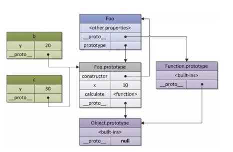

# es6

## 箭头函数和普通函数的区别
| |箭头函数|普通函数|
|-|-|-|
|this|没有自己的this，只会从自己的作用域链的上一层继承this,call apply bind 都改变不了其指向|new绑定 > call apply bind 显式绑定 > 作为对象的方法调用（隐式绑定）> 默认绑定|
|arguments|无|-|
|super|无|-|
|new.target|无|-|
|使用new操作符，用作构造器|不能用作构造器，和new一起使用会抛出错误|-|
|prototype属性|无|-|
|使用yield关键字，用作函数生成器|不能|-|

## Map
Map对象保存键值对。任何值（对象或原始值）都可以作为一个键或一个值。

### Objects 和 maps 比较
|-|Object|Map|
|-|-|-|
|键|只能是字符串或者Symbbols|任意值，包括函数、对象、基本类型|
|键值有序性|无序|有序，按照插入的顺序返回键值|
|size属性|无|有|
|原型|有自己的原型，原型链上的键名可能和自己对象上设置的键名产生冲突|-|
|频繁增删键值对|-|有性能优势|

## promise

### 限制并发
https://blog.csdn.net/tonghonglei/article/details/88054116
先写下思路，粘贴下代码，以后再闭卷手写

1. 几个售票窗口的思路
这个思路好理解些，我在头条面试时还对其做了点修改

```js
//省略代码
let count = 0;
//对加载图片的函数做处理，计数器叠加计数
function runOne(){
    count++;
    console.log("并发数:",count)
    //条件判断，urls长度大于0继续，小于等于零说明图片加载完成
    if(urls.length>0&&count<=3){
    //shift从数组中取出连接
        loadImg(urls.shift()).then(()=>{
        //计数器递减
            count--
            //递归调用
            }).then(runOne)
    }
}
function runMultiple(){
//循环开启三次
    for(let i=0;i<3;i++){
        runOne();
    }
}
runMultiple()
```

2. promise.race的使用
这个比较难理解难想到

用 Promise.race来实现，先并发请求3个图片资源，每个Promise都要返回其在运行中的数组中下标值。然后不断的调用 Promise.race 来返回最快改变状态的 Promise，然后将数组（promises ）中这个完成的 Promise 所在的位置换成一个新的 Promise实例，直到全部的 url 被取完。

Return value
A pending Promise that asynchronously yields the value of the first promise in the given iterable to fulfill or reject.

Promise.race()的返回值：
一个pending状态的Promise，它会异步产出给定的迭代对象中第一个fulfill或者reject的promise的value.

```js
//省略代码
function limitLoad(urls, handler, limit) {
    // 对数组做一个拷贝
    const sequence = [].concat(urls)
    let promises = [];

    //并发请求到最大数
    promises = sequence.splice(0, limit).map((url, index) => {
        // 这里返回的 index 是任务在 promises 的脚标，
        //用于在 Promise.race 之后找到完成的任务脚标
        return handler(url).then(() => {
            return index
        });
    });

    (async function loop() {
        let p = Promise.race(promises);
        for (let i = 0; i < sequence.length; i++) {
            p = p.then((index) => {
                promises[index] = handler(sequence[i]).then(() => {
                    return index
                });
                return Promise.race(promises)
            })
        }
    })()
}
limitLoad(urls, loadImg, 3)

```


### 自己实现promise
https://www.cnblogs.com/liuzhenwei/p/5235473.html

以下是我自己实现的，周日间歇写了一天，这种事情真是细致活！参考了上面的链接，肯定还有很多不完善的地方，鉴于还有其他基础重要的知识需要复习学习，先就做到这个程度。

自己实现什么功能，一定是要先把如何用这个功能写上，把常用的功能都包括在用法中，然后根据用法去实现。实现时有点类似画画，先把大框架搭建起来，然后再去补充细节。

```js
class myPromise {
    constructor(excutor) {
        excutor(this.resolve.bind(this), this.reject.bind(this));
    }
    sucCbs = [];
    errCbs = [];
    state = "pending";
    value = "";

    //resolve 和 reject 函数被调用时，分别将promise的状态改为fulfilled（完成）或rejected（失败）。
    resolve(val) {
        this.value = val;
        this.state = "fulfilled";
        debugger;
        //如果resolve是在同步代码里调用的，那会比then方法先执行，用setTimeout来保证then方法里面的回调函数注册完成
        setTimeout(() => {
            debugger;
            let len = this.sucCbs.length;
            for (let ind = 0; ind < len; ind++) {
                const fn = this.sucCbs[ind];
                //如果传入另一个myPromise实例
                if (this.value.constructor === this.constructor) {
                    debugger;
                    let newP = this.value;
                    for (ind++; ind < len; ind++) {
                        // newP.sucCbs.push(fn);
                        newP.then(fn);
                    }
                } else {
                    this.value = fn(this.value);
                }
            }

            return this;
        }, 0);
    }
    reject(err) {
        this.state = "rejected";
        this.errCbs.length && this.errCbs.shift()(err);
        return this;
    }
    then(successHandler, errHandler) {
        let isSuccessHandlerFunction = typeof successHandler == "function";
        switch (this.state) {
            case "pending":
                isSuccessHandlerFunction && this.sucCbs.push(successHandler);
                break;
            case "fulfilled":
                if (isSuccessHandlerFunction) {

                    //展开参数里面的myPromise对象 thenable没有考虑到 先不抠这么细致
                    while (this.value.constructor === this.constructor) {
                        this.value = this.value.value;
                    }
                    this.value = successHandler(this.value);
                }
            default:
                break;
        }

        typeof errHandler == "function" && this.errCbs.push(errHandler);
        return this;
    }
}

//用法：
var b = new myPromise((resolve, reject) => {
    debugger;
    resolve("bbbb");
});
var a = new myPromise((resolve, reject) => {
    debugger;
    // resolve("111111");
    resolve(b);
    // setTimeout(() => {
    //     resolve("hhhh"); //如果同步里有个resolve,异步回调里还有个resolve??
    //     // debugger;
    //     // reject("errrrrr");
    // }, 1000);
})
    .then(res => {
        debugger;
        const msg = "then1: " + res;
        console.log(msg);
        return msg;
    })
    .then(
        res => {
            const msg = "then2: " + res;
            console.log(msg);
            return msg;
        },
        err => {
            console.log(err);
            return err;
        }
    )
    .then(res => {
        console.log("then3 : " + res);
    });
```

## 展开语法与剩余参数

展开语法(Spread syntax), 可以在函数调用/数组构造时, 将数组表达式或者string在语法层面展开；还可以在构造字面量对象时, 将对象表达式按key-value的方式展开。

剩余参数语法允许我们将一个不定数量的参数表示为一个数组。

展开语法将数组展开为其中的各个元素，而剩余语法则是将多个元素收集起来并“凝聚”为单个元素。

## export

有两种不同的导出方式，每种方式对应于上述的一种语法：

> 命名导出：

```js
// exports a function declared earlier
export { myFunction }; 

// exports a constant
export const foo = Math.sqrt(2);
```

导入用花括号，在导入期间，必须使用相应对象的相同名称。
```js
import { cube, foo } from 'my-module.js';
```

> 默认导出

```js
//默认导出（函数）：
export default function() {}
```

```js
// 默认导出（类）：
export default class {}
```

可以使用任何名称导入默认导出
```js
import cube from 'my-module';
```

## 对比es6,node中如何导入导出

-  module.exports vs exports

The exports variable is available within a module's file-level scope, and is assigned the value of module.exports before the module is evaluated.

It allows a shortcut, so that module.exports.f = ... can be written more succinctly as exports.f = .... However, be aware that like any variable, if a new value is assigned to exports, it is no longer bound to module.exports:

```
module.exports.hello = true; // Exported from require of module
exports = { hello: false };  // Not exported, only available in the module
```

环境| es6 |  node  
-|-|-
导入 | import | require(id) |
导出 | export | The module.exports object is created by the Module system. Sometimes this is not acceptable; many want their module to be an instance of some class. To do this, assign the desired export object to module.exports. Assigning the desired object to exports will simply rebind the local exports variable, which is probably not what is desired. 

## let var 区别
[原文](http://blog.csdn.net/nfer_zhuang/article/details/48781671)
### let 要在严格模式下使用

### 声明后未赋值，表现相同

### 使用未声明的变量，表现不同:
 ```js
 (function() {
  console.log(varTest); //输出undefined(注意要注释掉下面一行才能运行)
  console.log(letTest); //直接报错：ReferenceError: letTest is not defined

  var varTest = 'test var OK.';
  let letTest = 'test let OK.';
}());
 ```
#### 暂时性死区
https://www.cnblogs.com/ricoliu/p/6149912.html


### 重复声明同一个变量时，表现不同：
```js
'use strict';

(function() {
  var varTest = 'test var OK.';
  let letTest = 'test let OK.';

  var varTest = 'varTest changed.';
  let letTest = 'letTest changed.'; //直接报错：SyntaxError: Identifier 'letTest' has already been declared

  console.log(varTest); //输出varTest changed.(注意要注释掉上面letTest变量的重复声明才能运行)
  console.log(letTest);
}());
```

### 变量作用范围，表现不同:
块语句（或其他语言的复合语句）用于组合零个或多个语句。**该块由一对大括号界定。通过var声明的变量没有块级作用域,相比之下，使用 let和const声明的变量是有块级作用域的。**

```js
'use strict';

(function() {
  var varTest = 'test var OK.';
  let letTest = 'test let OK.';

  {
    var varTest = 'varTest changed.';
    let letTest = 'letTest changed.';
  }

  console.log(varTest); //输出"varTest changed."，内部"{}"中声明的varTest变量覆盖外部的letTest声明
  console.log(letTest); //输出"test let OK."，内部"{}"中声明的letTest和外部的letTest不是同一个变量
}());
```

使用let时， 形如for (let x...)的循环在每次迭代时每个闭包将捕捉一个循环变量的不同值作为副本，而不是所有闭包都捕捉循环变量的同一个值。

## 块级作用域

块语句（或其他语言的复合语句）用于组合零个或多个语句。**该块由一对大括号界定。通过var声明的变量没有块级作用域,相比之下，使用 let和const声明的变量是有块级作用域的。**

```js
foo('outside');  // TypeError: foo is not a function
{
  function foo(location) {
   console.log('foo is called ' + location);
  }
  foo('inside'); // 正常工作并且打印 'foo is called inside' 
}
foo('outside bottom'); // 正常工作并且打印 'foo is called outside bottom' 
```

## class

类实际上是个“特殊的函数”，就像你能够定义的函数表达式和函数声明一样，类语法有两个组成部分：类表达式和类声明。

```js
//类声明
class Rectangle {
  constructor(height, width) {
    this.height = height;
    this.width = width;
  }
}
```

### Extend class 与 __proto__
```js
class a {
    count = 1;
    getCount() {
        return this.count;
    }
}
class b extends a {
    count = 2;
}
let c = new a();
let d = new b();
d.__proto__.getCount();  //undefined
```

《你不知道的js-下卷》p190
```js
class Foo {
    constructor(a, b) {
        this.x = a;
        this.y = b;
    }
    gimmeXY() {
        return this.x * this.y;
    }
}
```
可以把前面代码中的 class 语法定义粗略理解为下面这个等价前 ES6 代码，之前有过原型 风格编码经验的开发者可能会对此非常熟悉: 
```js
function Foo(a, b) {
    this.x = a;
    this.y = b;
}
Foo.prototype.gimmeXY = function() {
    return this.x * this.y;
};
```
Bar extends Foo 的意思当然就是把 Bar.prototype 的 \[[Prototype]] 连接到 Foo.prototype。 

所以这里
```js
d.__proto__===b.prototype
b.prototype.__proto__===a.prototype
```


**函数声明和类声明之间的一个重要区别是函数声明会声明提升，类声明不会。你首先需要声明你的类，然后访问它，否则会抛出一个ReferenceError**

类声明和类表达式的主体都执行在**严格模式**下。比如，构造函数，静态方法，原型方法，getter和setter都在严格模式下执行。

构造函数方法是一个特殊的方法，其用于创建和初始化使用一个类创建的一个对象。一个类只能拥有一个名为 “constructor”的特殊方法。如果类包含多个构造函数的方法，则将抛出 一个SyntaxError 。

一个构造函数可以使用 super 关键字来调用一个父类的构造函数。

static 关键字用来定义一个类的一个静态方法。调用静态方法不需要实例化该类，但不能通过一个类实例调用静态方法。静态方法通常用于为一个应用程序创建工具函数。

类不能扩展常规（不可构造/非构造的）对象。如果要继承常规对象，可以改用Object.setPrototypeOf()

## 迭代器

一个迭代器对象 ，知道如何每次访问集合中的一项， 并跟踪该序列中的当前位置。在  JavaScript 中 迭代器是一个对象，它提供了一个next() 方法，用来返回序列中的下一项。这个方法返回包含两个属性：done和 value。
迭代器对象一旦被创建，就可以反复调用next()。

## 生成器

虽然自定义的迭代器是一个有用的工具，但由于需要显式地维护其内部状态，因此需要谨慎地创建。Generators提供了一个强大的选择：它允许你定义一个包含自有迭代算法的函数， 同时它可以自动维护自己的状态。

> 使用 Generator 函数，执行一个真实的异步任务。

```js
var fetch = require('node-fetch');

function* gen(){
  var url = 'https://api.github.com/users/github';
  var result = yield fetch(url);
  console.log(result.bio);
}
```

上面代码中，Generator 函数封装了一个异步操作，该操作先读取一个远程接口，然后从 JSON 格式的数据解析信息。就像前面说过的，这段代码非常像同步操作，除了加上了 yield 命令。

执行这段代码的方法如下。

```js
var g = gen();
var result = g.next();

result.value.then(function(data){
  return data.json();
}).then(function(data){
  g.next(data);
});
```