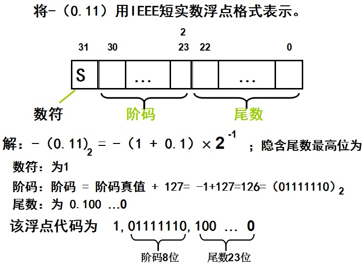

# 系统

## 内存

内存又称主存，是CPU能直接寻址的存储空间，由半导体器件制成。内存的特点是存取速率快。内存是电脑中的主要部件，它是相对于外存而言的。我们平常使用的程序，如Windows操作系统、打字软件、游戏软件等，一般都是安装在硬盘等外存上的，但仅此是不能使用其功能的，必须把它们调入内存中运行，才能真正使用其功能，我们平时输入一段文字，或玩一个游戏，其实都是在内存中进行的。就好比在一个书房里，存放书籍的书架和书柜相当于电脑的外存，而我们工作的办公桌就是内存。通常我们把要永久保存的、大量的数据存储在外存上，而把一些临时的或少量的数据和程序放在内存上，当然内存的好坏会直接影响电脑的运行速度。
内存就是暂时存储程序以及数据的地方，比如当我们在使用WPS处理文稿时，当你在键盘上敲入字符时，它就被存入内存中，当你选择存盘时，内存中的数据才会被存入硬（磁）盘。

## 浮点数
 IEEE 754格式

 

## 线程与进程

一个程序至少有一个进程,一个进程至少有一个线程.
进程在执行过程中拥有独立的内存单元，而多个线程共享内存，从而极大地提高了程序的运行效率。

| 进程 | 线程 | 
| ------| ------ | 
| 进程有独立的地址空间，一个进程崩溃后，在保护模式下不会对其它进程产生影响。多进程的程序要比多线程的程序健壮。 | 多个线程共享内存，提高了程序的运行效率，线程之间没有单独的地址空间，一个线程死掉就等于整个进程死掉。 | 
|  | 有自己的堆栈和局部变量 |
| 进程切换时，耗费资源较大 | 线程切换时，耗费资源较小 |
|| | 

操作系统的设计，可以归结为三点：

（1）以多进程形式，允许多个任务同时运行；

（2）以多线程形式，允许单个任务分成不同的部分运行；

（3）提供协调机制，一方面防止进程之间和线程之间产生冲突，另一方面允许进程之间和线程之间共享资源。

一个浏览器是一个进程。虽然js是单线程的，但是浏览器是多线程的，v8引擎也是多线程的，比如有渲染线程，有处理请求的线程。


## linux

> linux服务器下文件传输命令？如果要断点续传呢？
scp传输。scp  源文件  目标文件

但是scp不能实现断点续传。要实现传输中断后从断掉的地方接着来，可以用curl

```
//如果在下载dodo1.JPG的过程中突然掉线了，可以使用以下的方式续传
# curl -C -O http://www.doiido.com/dodo1.JPG
```
或者curl -r 可以实现分段下载

> cat、more、less

均可用来查看文件内容，主要区别有：
cat是一次性显示整个文件的内容，还可以将多个文件连接起来显示，它常与重定向符号配合使用，适用于文件内容少的情况；
more和less一般用于显示文件内容超过一屏的内容，并且提供翻页的功能。
more比cat强大，提供分页显示的功能，less比more更强大，提供翻页，跳转，查找等命令。而且more和less都支持：用空格显示下一页，按键b显示上一页。下面详细介绍这3个命令。

less 工具也是对文件或其它输出进行分页显示的工具，应该说是linux正统查看文件内容的工具，功能极其强大。less 的用法比起 more 更加的有弹性。在 more 的时候，我们并没有办法向前面翻， 只能往后面看，但若使用了 less 时，就可以使用 [pageup] [pagedown] 等按键的功能来往前往后翻看文件，更容易用来查看一个文件的内容！除此之外，在 less 里头可以拥有更多的搜索功能，不止可以向下搜，也可以向上搜。


### linux 常用指令

https://segmentfault.com/a/1190000011068772

1. 查看目录下有什么文件信息

ls //list查看当前目录下有什么文件
ls -l或ls ll //list -list 通过详细内容形式查看目录下的文件内容
ls 目录 //查看指定目录下文件名字信息
ls -l 目录 //以详细列表形式查看指定目录下文件名字信息
ls -a //list all 查看全部文件，包括隐藏文件
ls -al //list list all 以详细列表形式查看全部文件，包括隐藏文件
ls -i //查看目录下文件名字的索引号码

2. 目录切换

cd 目录名字
cd.. //向上级目录切换
cd~ //快速切换回自己的家目录

3. 查看当前操作位置

pwd

4. 查看操作者信息(是谁在操作系统)

whoami

5. 不同用户间的切换

su - //切换为root用户
su - root //效果同上
su 普通用户名称 //向普通用户切换
exit //当前用户退回到之前用户

su多次使用，用户会“累加”，建议“su” 和 “exit”匹配使用

6. 图形模式与命令模式进行切换

init 3 //图形 向 命令模式切换
init 5 //命令 向 图形模式切换

7. 查看指令对应的可以执行程序文件位置

which 指令

8. 目录操作
1)创建目录 make directory

mkdir newdir
mkdir -p newdir/newdir/newdir //递归方式创建多级目录
newdir新目录多于1个层次(2/3/4等)就设置-p参数，如果就一个新的目录则无需-p参数
mkdir dir/newdir
mkdir dir/dir/newdir
mkdir -p dir/newdir/newdir

2) 移动(改名字)目录 move
(目录/文件 都可以操作)

mv dir1 dir2 //dir1移动到dir2目录下,并给改名字为"原名"
mv dir1 dir2/newdir //dir1移动到dir2目录下,并给改名字为newdir
mv dir1/dir2 dir3/dir4 //dir2移动到dir4目录下,并给改名字为"原名"
mv dir1/dir2 dir3/dir4/newdir //dir2移动到dir4目录下,并给改名字为 newdir
mv dir1/dir2 ./ //dir2移动到 当前 目录下,并给改名字为"原名"
mv dir1/dir2 ./newdir //dir2移动到 当前 目录下,并给改名字为newdir

3) 复制(改名字)目录 copy
(目录/文件 都可以操作)
① 复制普通文件

cp file1 dir1 //file1被复制到dir1目录下一份，并给改名字为“原名”
cp file1 dir1/newfile //file1被复制到dir1目录下一份，并给改名字为newfile

② 复制目录 -r参数要求
//recursive递归方式拷贝目录

cp -r dir1 dir2 //dir1被复制到dir2目录下一份，并给改名字为“原名”
cp -r dir1 dir2/newdir //dir1被复制到dir2目录下一份，并给改名字为newdir
cp -r dir1/dir2/dir3 dir4/dir5 //dir3被复制到dir5目录下一份，并给改名字为"原名"

4) 删除 remove

rm filename //普通文件删除
rm -r dir //删除目录[无视层次]需要-r参数
rm -rf 文件 //recursive force 递归强制删除文件,force 避免删除隐藏文件的提示
rm -rf / //递归强制方式删除系统里边的全部内容

9. 文件操作
1) 查看文件内容

cat filename //在终端显示文件全部内容
more filename //通过"敲回车"方式从第一行逐行查看文件内容,不支持回看,q键退出查看
less filename //"上下左右"键方式查看文件各个部分内容,支持回看，q键退出查看
head -n filename //查看文件“前n行”内容
tail -n filename //查看文件“末尾n行”内容
wc filename //计算文件行数

2) 创建文件

touch filename 
touch dir/filename

3) 追加内容(文件不存在会“自动”创建)

echo 内容 > filename //给文件“覆盖写”方式追加内容
echo 内容 >> filename //给文件纯追加内容

10. 用户操作
user,配置文件/etc/passwd

1) 创建 add
useradd username //创建用户会同时创建同名组
useradd -g 组编号 username //创建用户的同时设置组别
useradd -g 组编号 -u 用户编号 -d 家目录 username //创建用户同时，指定组别、用户编号、家目录

2) 修改 modify
usermod -g gid username //修改组别是常见操作
usermod -g gid -u uid -d 家目录 -l newname username//修改组别、用户编号、家目录、名字

注意：家目录修改后需要手动创建，不同于创建用户家目录设置

创建用户时设置家目录，该目录会自动创建
修改用户家目录时，该目录不会自动创建(需要手动创建)
3) 删除 delete

userdel username //删除用户(删除passwd文件对应信息)，此时其家目录需要手动删除
userdel -r username //删除用户的同时也删除其“家目录”

11. 组别操作
group, 配置文件/etc/group
1) 创建 add

groupadd groupname

2) 修改 modify

groupmod -g gid -n newname groupname

3) 删除 delete

groupdel 组名

//注意：只有空组(内部没有用户信息)才允许删除

12. vi编辑器使用
1) 命令模式-->编辑模式切换(插入/Insert)

a "光标" 向后移动一位
i "光标" 和 "内容" 没有变化
o "新"起一个空白行
s "删除"光标所在字符

2) 尾行模式作用

:q quit退出编辑器
:wq write quit 保存并退出
:w write 保存
:q! 强制退出(不要保存)
:w! 强制写保存
:wq! 强制保存退出

:set number 或 set nu //给编辑器设置行号
:set nonumber 或 set nonu //取消行号设置

:数字 光标跳转到数字所在行
:/内容/ 或 /内容 //内容查找，小写n(next)下一个,大写N(next)上一个

:s/cont1/cont2/ //把光标所在行的"第一个"cont1替换为cont2
:s/cont1/cont2/g //把光标"所在行"的全部cont1替换为cont2
:%s/cont1/cont2/g //把"整个文档"中的全部cont1替换为cont2

3) 命令模式操作
    ① 光标移动
    a. 字符级
        上(k)  下(j)  左(h)  右(l) 键
    b. 单词级
        `w`  word下个单词首字母
        `e`  end下(本)个单词尾字母
        `b`  before上(本)个单词首字母
    c. 行级
        `$` 行尾
        `0` 行首
    d. 段落级(两部分内容中间有空行，彼此成为段落)
        `{`  上(本)个段落首部
        `}`  下(本)个段落尾部
    e. 屏幕级(不给翻屏)
        `H`  屏幕首部
        `L`  屏幕尾部
    f. 文档级
        `G`   文档尾行
        `1G`  文档第一行
        `nG`  文档第n行

    ② 内容删除
        `dd`      删除光标所在行
        `n+dd`    包括当前行在内向下删除n行内容
        `x`       字符级删除，删除光标所在字符
        `cw`      光标所在字符删除至单词结尾(是删除单词的便捷方式)
                同时会进入编辑模式
    
    ③ 内容复制
        `yy`      复制光标所在行
        `n+yy`    包括当前行在内向下复制n行内容
        `p`       对复制(删除)好的内容进行粘贴操作
    
    ④ 便捷操作
        `u`       undo撤销，从文件打开后的所有操作都可以撤销
        `r`       对单词字符进行替换
        `.`       重复执行"最近"的一条指令
        `J`       合并上下两行
13. 权限设置
1) "字母相对方式"设置权限
权限： r读 w写 x执行
用户： u主人 g同组 o其他组
chmod u+/-rwx, g+/-rwx, o+/-rwx 文件

不同用户通过",逗号"分隔
在同一个用户里边，+/-只能用“一个”
"rwx"在同一个用户里边可以设置一个或多个
"ugo" 每次权限操作可以设置一个或多个用户
chmod u+rw filename //主人增加读、写
chmod g-rx filename //同组删除读、执行
chmod u-w,g+x filename //主人删除写，同组增加执行
chmod o+w,o-x filename //其他组用户“增加写、删除执行”

2) "数字绝对方式" 设置权限
读:4 写:2 执行:1
权限类型：
0: 没有权限
1: 执行
2: 写
3: 写、执行
4: 读
5: 读、执行
6: 读、写
7： 读、写、执行

chmod ABC filename //ABC分别代表主人、同组、其他组用户权限
chmod 764 filename //主人读、写、执行， 同组读、写， 其他读
chmod 777 filename //满贯权限
chmod 000 filename //所有用户没有任何权限

字母和数字方式取舍：
权限修改的比较"少"，就使用字母方式
权限修改的比较"多"，就使用数字方式

14. 在文件中查找指定内容
grep 内容 (绝对/相对路径)目标文件

grep sbin /etc/passwd //在passwd文件中查找sbin字样，会把sbin所在行的内容都输出

15. 查看文件占据磁盘空间大小
du -h 文件/目录

du -h 文件名称 //以k M的形式查看文件占据磁盘空间大小

16. 文件查找
find 现值查找目录 选项 选项值 选项 选项值....
具体选项：
① name 根据文件名字查找指定的文件
find 目录 -name 完整文件名称

find / -name passwd[完整名称] //"递归遍历"系统全部目录查找名字等于passwd的文件 
find /etc -name passwd[完整名称] //递归遍历/etc及内部所有目录查找 名字等于passwd的文件

find 目录 -name "an*"[部分名称] //模糊查找文件名字以an开始的

② 对查找的目录层次进行限制
-maxdepth 限制查找的最"深"层次
-mindepth 限制查找的最"浅"层次

find / -name passwd -mindepth 3 -maxdepth 4 //在3到4个层次的目录里边定位passwd文件

③ 根据文件大小进行查找
size 单位

find ./ -size 50c //在当前目录下查找大小[等于]50个字节的文件

单位：

数量         单位      实际大小
100 -------> 512字节：【100*512字节】
50c -------> 字节 ：   【50字节】
50k -------> 千字节： 【50*1024字节】
50M -------> 兆字节    【50*1024*1024字节】
find ./ -size +50c //在当前目录下查找大小[大于]50个字节的文件
find ./ -size -50c //在当前目录下查找大小[小于]50个字节的文件

17. 开关机指令

reboot //重启
poweroff //关机


